# AstroClock Engine Paths Review Resolution - 2026-05-19

## Scope

This note documents the review of how the AstroClock UI path connects to the calculation engine and the source-only fixes made from that review.

No packaged build artifacts were edited. The source changes are limited to:

- `frontend/src/**`
- `backend/**`
- `frontend/backend/**`

## Active Workflow

```mermaid
flowchart LR
  Electron["Electron shell"] --> Preload["preload.js exposes API_BASE_URL"]
  Preload --> React["React App route: astro-clock"]
  React --> Feature["frontend/src/features/astroclock/AstroClock.jsx"]
  Feature --> ApiClient["frontend/src/features/astroclock/api.mjs"]
  ApiClient --> Flask["backend/app.py registers astro_clock_bp"]
  Flask --> Routes["backend/astro_clock_api.py"]
  Routes --> Context["request clock context helpers"]
  Context --> ClockEngine["AstroClockEngine"]
  ClockEngine --> Horary["HoraryEngine.judge()"]
```



The active AstroClock screen is `AstroClockPage`, imported by `frontend/src/App.jsx` from `frontend/src/features/astroclock/AstroClock.jsx`. That feature builds the clock context from mode, date/time, location, timezone, coordinates, and house system. The API client serializes that context into AstroClock requests. The Flask blueprint then resolves request settings before invoking `AstroClockEngine`, which delegates chart judgment to the horary engine.

## Issues Resolved

1. Stale inline AstroClock component in `frontend/src/App.jsx`

   The app was already routed through `AstroClockPage`, but `App.jsx` still contained an unused legacy inline `AstroClock` component. That stale component referenced older API paths and made the source graph misleading.

   Resolution: removed the unused inline component and added `frontend/src/tests/astroClockSourceBoundaries.test.mjs` to prevent it from returning.

2. Context-free `/api/astro-clock/current`

   `AstroClockAPI.getCurrent()` ignored manual/snap clock context and always called `/api/astro-clock/current` without query parameters. The backend route also called `eng.get_current_data()` directly, bypassing the same request-context helper used by context-safe AstroClock paths.

   Resolution: `AstroClockAPI.getCurrent(opts)` now serializes clock context with `appendClockContext`, and the backend `/current` route now uses `_data_for_request_clock_context(eng)` before serialization. The backend source twin in `frontend/backend/astro_clock_api.py` was synced from `backend/astro_clock_api.py`.

## Regression Coverage

- `frontend/src/tests/astroclockApi.test.mjs` now asserts that `getCurrent()` sends manual mode, datetime, location, timezone, coordinates, and house system.
- `tests/test_astroclock_internal_chart_passthrough.py` now asserts that `/api/astro-clock/current` passes request-derived `AstroClockSettings` into the engine.
- `frontend/src/tests/astroClockSourceBoundaries.test.mjs` now asserts that `App.jsx` imports the feature AstroClock page and does not contain a stale inline `const AstroClock = (...)` component.

## Verification

Run from repository root:

```powershell
python -m pytest tests\test_astroclock_internal_chart_passthrough.py tests\test_astroclock_chart_bundle_helpers.py tests\test_astroclock_adapter_fixes.py -q
```

Result: `22 passed, 1 warning`.

```powershell
npm --prefix frontend run test:ui -- src/tests/astroclockApi.test.mjs src/tests/receptionsTile.test.jsx src/tests/astroClockSourceBoundaries.test.mjs
```

Result: `3 passed` test files, `42 passed` tests.

```powershell
cmd /c fc /b backend\astro_clock_api.py frontend\backend\astro_clock_api.py
```

Result: no differences encountered.
