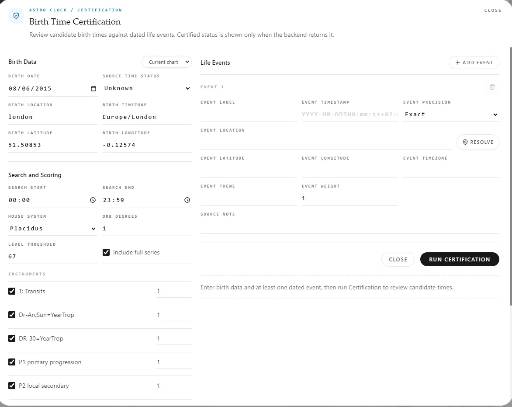

# Birth Time Certification Is Not Guesswork: How Vox Stella Reviews Source-Backed Birth Times

When people hear "certification," they often assume the software has simply declared a birth time correct. That is too loose for serious birth-time work.

A useful Birth Time Certification workflow has to do something stricter: separate the claim from the evidence behind it. It needs to ask where the time came from, how the data was reviewed, and what kind of conclusion the system can responsibly return.

That distinction matters because birth times come from different evidence lanes. A time may be printed on a certificate, preserved in a family record, copied into an astrology database, remembered by a relative, or reconstructed later through rectification review. Those are not equivalent claims.

Vox Stella's Birth Time Certification feature is deliberately conservative for that reason. It does not treat a high scan score as the same thing as an externally sourced record. It does not call a rectified candidate "certified" just because the model found an attractive minute. Instead, the workflow keeps two lanes separate:

1. Source certification: the birth time is marked as externally sourced, such as AA, certificate, record, family exact, or certified.
2. Rectification review: the model scans candidate birth times against dated life events and returns the strongest candidate windows.

That separation is the feature. It keeps the conclusion tied to the evidence.

## Where Birth Time Certification Lives In Vox Stella

Vox Stella's Birth Time Certification workflow lives inside Astro Clock. The interface starts with the birth data, then asks for event evidence. The user enters the date, location, timezone, source status, search range, house system, scoring threshold, enabled instruments, and life events.

The birth section defines the chart being reviewed:

- Birth date
- Birth location
- Latitude and longitude
- Timezone
- Source time status
- Search start and end time

The life-event section defines the evidence being tested:

- Event label
- Event timestamp
- Event precision
- Event location
- Event timezone
- Event theme
- Event weight
- Source note

Precision matters. An exact event is stronger than a day-level event. A day-level public event can still be useful, but it should not be treated like a clocked medical record or official timestamp. Vox Stella encodes this distinction with event precision levels: exact, minutes, hours, days, weeks, months, or skip.

The review engine then runs a candidate scan. For each candidate birth minute, it compares the natal chart to the dated event charts through enabled instruments, including transits, solar-arc style direction, profection-style direction, primary progression, secondary progression, tertiary progression, and minor progression.

The result is not a forced single answer. It is a scored field of candidate times, threshold windows, and a final review status.

| Status | Meaning |
| --- | --- |
| Certified source | The birth time is externally sourced. Rectification review is not required for certification. |
| Rectified candidate | The scan found a strong candidate across sufficiently independent event evidence, but it is still a model-based rectification result. |
| Unresolved rectification | The scan did not isolate a candidate strongly enough. |
| Insufficient data | The input was not enough to run a meaningful review. |

This is the language that keeps the tool honest. The system can certify a record-backed time. It can propose a rectified candidate. It can also refuse to overstate a weak or crowded candidate field.

For broader context, readers can compare this workflow with the Vox Stella [product page](/product), the [features overview](/features), and the [Astro Clock documentation hub](/docs/astro-clock).

## How We Tested The Workflow

To demonstrate the workflow, we used three public charts with known or source-backed birth times:

1. Queen Elizabeth II
2. Muhammad Ali
3. James Dean

Each chart was tested in two passes.

First, we ran the known birth time with the source status marked as AA or source-backed. That tests the certification lane.

Second, we hid the source status and ran a blind validation scan around the known birth time. That tests the rectification review lane. The point of the blind validation scan is not to replace the record. The point is to ask a narrower question: if the model did not know the time was externally sourced, would it concentrate activity near the known time?

This produces a cleaner story than a single headline score. We can see when Vox Stella certifies because of source evidence, when the model lands near the known hour, and when the model stays unresolved.

## Case 1: Queen Elizabeth II As The Clean Source-Certification Case

Queen Elizabeth II is the cleanest first case because the public source evidence is strong. The Royal Collection Trust states that Princess Elizabeth was born at 2:40am on 21 April 1926 at 17 Bruton Street, Mayfair, London. Astro-Databank/Astro.com also lists the chart as a high-quality source-backed chart.

Birth data used:

| Field | Value |
| --- | --- |
| Date | 21 April 1926 |
| Known time | 02:40 |
| Location | Mayfair, London, England |
| Timezone | Europe/London |
| Source status | AA/source-backed |

Event anchors used:

| Event | Date/time used | Precision |
| --- | --- | --- |
| Marriage to Prince Philip | 20 November 1947, 11:30 | Minutes |
| Birth of Prince Charles | 14 November 1948, 21:14 | Exact |
| Accession marker after George VI's death | 6 February 1952, 07:30 | Hours |
| Coronation service | 2 June 1953, 11:15 | Minutes |
| Death at Balmoral | 8 September 2022, 15:10 | Exact |

The source-backed certification pass used AA source status and a one-minute search at 02:40. Vox Stella returned a high-confidence Certified Source result. That is the certification outcome. The chart is certified because the time is externally sourced. The one-minute scan should not be presented as independent rectification evidence; in this lane, the source status is doing the certification work.

Then we ran the blind validation pass, with source status treated as unknown and a two-hour search from 01:40 to 03:40.

Blind validation result:

| Item | Result |
| --- | --- |
| Review status | Unresolved rectification |
| Confidence | Low |
| Top candidate | 02:14 |
| Distance from known time | 26 minutes |
| Known 02:40 strength | 66.39 |
| Known 02:40 rank | 59 |

The strongest candidate windows were:

| Rank | Window | Peak |
| ---: | --- | ---: |
| 1 | 02:11-02:28 | 100.00 |
| 2 | 02:43-02:50 | 94.32 |
| 3 | 02:32-02:39 | 92.55 |

This is a good example of conservative interpretation. The blind validation scan landed in the correct early-morning corridor, and two strong windows bracketed the known time. But the exact 02:40 row did not become an isolated model winner.

The careful conclusion is: the source certifies 02:40, and the blind validation scan found nearby activity without justifying an independent rectification claim.

That is exactly how the feature should behave.

## Case 2: Muhammad Ali As The Strongest Near-Hit Validation Case

Muhammad Ali is the strongest second case because the source-backed time is clean and the blind validation scan landed very close.

Birth data used:

| Field | Value |
| --- | --- |
| Date | 17 January 1942 |
| Known time | 18:35 |
| Location | Louisville, Kentucky, United States |
| Timezone | America/Kentucky/Louisville |
| Source status | AA/source-backed |

Event anchors used:

| Event | Date/time used | Precision |
| --- | --- | --- |
| Olympic light-heavyweight final | 5 September 1960, 21:00, Rome | Minutes |
| First world heavyweight title | 25 February 1964, Miami Beach | Days |
| Draft induction refusal | 28 April 1967, 08:30, Houston | Hours |
| Supreme Court conviction reversal | 28 June 1971, Washington DC | Days |
| Rumble in the Jungle | 30 October 1974, 04:00, Kinshasa | Minutes |
| Death in Scottsdale | 3 June 2016, 21:10 | Exact |

The source-backed run returned a high-confidence Certified Source result. Then the blind validation scan was run from 17:35 to 19:35.

Blind validation result:

| Item | Result |
| --- | --- |
| Review status | Unresolved rectification |
| Confidence | Low |
| Top candidate | 18:49 |
| Distance from known time | 14 minutes |
| Known 18:35 strength | 66.56 |
| Known 18:35 rank | 67 |

The strongest candidate windows were:

| Rank | Window | Peak |
| ---: | --- | ---: |
| 1 | 18:41-18:56 | 100.00 |
| 2 | 17:51-18:07 | 97.82 |
| 3 | 17:35-17:46 | 89.35 |
| 4 | 19:12-19:15 | 78.39 |
| 5 | 18:17-18:20 | 74.05 |
| 6 | 18:28-18:34 | 71.89 |

This is the best near-hit validation case in the set. The top model candidate was 14 minutes from the externally sourced time. A thresholded window also ran from 18:28 to 18:34, stopping one minute before the known 18:35 time.

Vox Stella did not call the chart independently rectified, because the candidate field was not isolated enough. But the blind validation scan did concentrate meaningful activity around the known source time.

For a blog demonstration, Ali is useful because the reader can see the distinction clearly:

- Certification: yes, because the time is externally sourced.
- Blind model agreement: strong near-hit.
- Final rectification status: unresolved, because the model remains conservative.

That is a credible result.

## Case 3: James Dean As The Caveated Stress Test

James Dean is the most interesting third case, but also the one that needs the most careful wording.

Astro-Databank/Astro.com currently lists Dean with a 09:00 birth time and a high Rodden rating, but its source notes also discuss older competing 2 AM material and a baby-card/certificate discrepancy. That makes Dean useful as a stress test for the feature. It is not as clean as Queen Elizabeth II or Muhammad Ali.

Birth data used:

| Field | Value |
| --- | --- |
| Date | 8 February 1931 |
| Listed known time | 09:00 |
| Location | Marion, Indiana, United States |
| Timezone | America/Indiana/Indianapolis |
| Source status | AA/source-backed, with caveat |

Event anchors used:

| Event | Date/time used | Precision |
| --- | --- | --- |
| Fairmount High School graduation | 16 May 1949 | Days |
| East of Eden world premiere | 9 March 1955, New York | Days |
| Completed final Giant scene | 27 September 1955, Burbank | Hours |
| Speeding ticket before crash | 30 September 1955, 15:30, Bakersfield | Minutes |
| Fatal crash near Cholame | 30 September 1955, 17:45 | Exact |

The source-backed run returned a high-confidence Certified Source result for the listed source status. The blind validation scan was run from 08:00 to 10:00.

Blind validation result:

| Item | Result |
| --- | --- |
| Review status | Rectified candidate |
| Confidence | Medium |
| Top candidate | 08:50 |
| Distance from listed time | 10 minutes |
| Known 09:00 strength | 51.18 |
| Known 09:00 rank | 79 |

The strongest candidate windows were:

| Rank | Window | Peak |
| ---: | --- | ---: |
| 1 | 08:48-08:54 | 100.00 |
| 2 | 09:08-09:13 | 86.89 |
| 3 | 09:26-09:27 | 75.27 |
| 4 | 08:30-08:32 | 74.71 |
| 5 | 09:52-09:54 | 71.91 |
| 6 | 09:16-09:17 | 70.44 |

This is the only case in the set where the blind validation scan returned a Rectified Candidate result. The model preferred 08:50, only 10 minutes before the listed 09:00 time. But the exact 09:00 row was not strong.

That makes Dean a good example of why the UI separates source status from scan score.

The source-backed lane can certify the listed source status, while the model lane prefers a nearby rectified candidate. Those are related, but they are not identical. Because the source-note nuance matters, Dean should be framed as a caveated stress test rather than the cleanest certification example.

That nuance is not a weakness. It is the feature doing its job.

## What The Three Runs Show

The three test cases produced three different but useful patterns:

| Case | Known time | Blind top candidate | Difference | Source-backed status | Blind status |
| --- | ---: | ---: | ---: | --- | --- |
| Queen Elizabeth II | 02:40 | 02:14 | 26 minutes | Certified source | Unresolved rectification |
| Muhammad Ali | 18:35 | 18:49 | 14 minutes | Certified source | Unresolved rectification |
| James Dean | 09:00 | 08:50 | 10 minutes | Certified source | Rectified candidate |

This is a stronger demonstration than simply showing three flattering scores. It shows the evidentiary discipline:

- Vox Stella certifies when the source supports certification.
- The model can land close without being allowed to overstate the result.
- A rectified candidate remains a model candidate unless an external source certifies it.
- Source notes matter.
- Precision levels matter.
- A transparent unresolved result is valuable.

That last point is important. If every run became a success story, the feature would be less trustworthy. Vox Stella is designed to say no when the evidence is not strong enough.

## Why This Matters For Birth-Time Review

Birth-time work has always had a reliability problem. A beautiful chart can be built on a weak time. A persuasive rectification review can hide thin event evidence. A database rating can be copied without the user understanding what kind of source it represents.

Vox Stella's Birth Time Certification feature addresses that problem by turning birth-time review into a structured workflow.

The user can see:

- What the birth-time source status is.
- What events were used.
- How precise those events are.
- Which candidate times scored highest.
- Which candidate windows cleared the threshold.
- Whether the model found a sufficiently isolated candidate.
- Whether the final status came from external source certification or from rectification review.

That makes the work auditable. It also makes the language more precise. A certified chart is not the same as a rectified chart. A near-hit is not the same as external source evidence. A high-scoring model candidate is not the same as a birth certificate.

## Conclusion

Birth Time Certification is not guesswork. It is a disciplined relationship between source, method, and conclusion.

In these tests, Vox Stella behaved the way a serious Birth Time Certification tool should behave. It certified source-backed charts when the input source status justified it. It ran blind validation scans around the known times. It found close candidate corridors in all three cases. It returned a rectified candidate for James Dean, and unresolved rectification for Queen Elizabeth II and Muhammad Ali when the model evidence was not isolated enough.

That restraint is the feature.

The purpose of Birth Time Certification is not to force certainty. It is to show exactly what kind of certainty is available.

## Sources

- Royal Collection Trust, Queen Elizabeth II school resources: https://www.rct.uk/schools/school-and-family-resources/a-focus-on-the-life-of-queen-elizabeth-ii-school-resources
- Astro-Databank/Astro.com, Queen Elizabeth II: https://www.astro.com/adbvip/adbvip_04_21.htm
- The Royal Family, Prince Charles birth facts: https://www.royal.uk/clarencehouse/70-facts-about-hrh-prince-wales
- Westminster Abbey, Elizabeth II: https://www.westminster-abbey.org/abbey-commemorations/royals/elizabeth-ii
- ITV News, Queen Elizabeth II death certificate reporting: https://www.itv.com/news/2022-09-29/the-queen-died-from-old-age-death-certificate-reveals
- TIME, Queen Elizabeth II accession timing caveat: https://time.com/4019998/queen-elizabeth-ii-reign-began/
- Astro-Databank/Astro.com, Muhammad Ali: https://www.astro.com/adbvip/adbvip_01_17.htm
- Olympic boxing schedule, 1960 light heavyweight: https://en.wikipedia.org/wiki/Boxing_at_the_1960_Summer_Olympics_%E2%80%93_Light_heavyweight
- Muhammad Ali Center, Rumble in the Jungle: https://alicenter.org/roadwork-to-the-rumble/
- Cornell Legal Information Institute, Clay v. United States: https://www.law.cornell.edu/supremecourt/text/403/698
- Al Jazeera, Muhammad Ali death reporting: https://www.aljazeera.com/sports/2016/6/4/death-of-muhammad-ali-boxer-died-of-septic-shock
- Astro-Databank/Astro.com, James Dean: https://www.astro.com/astro-databank/Dean%2C_James
- HISTORY, James Dean crash/death reporting: https://www.history.com/this-day-in-history/september-30/james-dean-dies-in-car-accident
- TCM, Behind the Camera - Giant: https://www.tcm.com/articles/581457/behind-the-camera-giant
- East of Eden premiere reference: https://en.wikipedia.org/wiki/East_of_Eden_%28film%29
