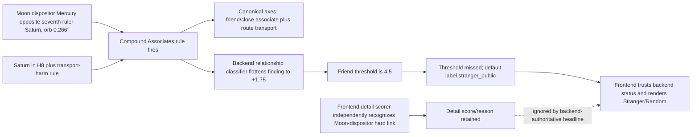

# Shirilla Relationship Signature Contradiction — 2026-08-04

## Status

Resolved and regression-tested on 2026-08-04.

The backend now treats the complete Moon-dispositor/seventh-ruler/transport
compound as a structured, low-confidence known-person gate. The Mackenzie
route returns `friend_acquaintance`; the frontend renders
**Friend/associate link** using the same backend score and evidence. The
component cannot infer `intimate_partner` or `family` by itself.

The rest of this document retains the reproduced pre-fix state and root-cause
analysis. See **Implemented resolution** and **Validation results** below for
the current behavior.

The pre-fix Mackenzie Shirilla payload contained a scoring-eligible compound
finding that explicitly supports a known-person or close-associate bridge. The
canonical axis assessment consequently includes `friend_or_close_associate`,
but the backend relationship classifier returns `stranger_public`, which the
frontend renders as **Stranger/Random**.

This is an engine-path contradiction, not a missing rule and not a frontend
wording invention.

## Reproduced Mackenzie configuration

At the fixture anchor, 2022-07-31 05:30 in Strongsville:

- Moon: Virgo, house 2;
- Moon dispositor: Mercury, house 2;
- seventh ruler: Saturn, house 8;
- Mercury opposite Saturn at 0.266 degrees;
- `moon.dispositor_to_seventh_ruler_hard=true`;
- `houses.seventh_ruler_in_8_or_12=true`;
- the scoring-eligible `vehicle_crash_or_transport_harm_pattern` fires; and
- the scoring-eligible
  `known_person_route_harm_moon_dispositor_bridge` fires.

The bridge finding is therefore not absent or filtered. It reaches the route
payload with category `Associates`, weight 2, and the rationale quoted in the
issue report.

Pre-fix backend relationship output with secondary factors enabled:

```text
primary_label: stranger_public
labels: [stranger_public]
confidence: Low
friend_acquaintance score: 1.75
friend evidence: known-person/associate finding
family score: 0.30
intimate_partner score: 0.00
```

The secondary-factor family value does not affect the core contradiction.
With secondary factors disabled, the known-person score remains 1.75 and still
falls through to `stranger_public`.

## Exact blind path



### 1. The compound configuration is collapsed into one generic point value

`backend/forensic/relationship_status.py` converts every recognized
known-person/associate finding to a flat `+1.75`. It does not preserve or score
the independent parts of this compound:

- Moon-dispositor to seventh-ruler hard aspect;
- exact 0.266-degree orb;
- seventh ruler in the eighth house; and
- independent transport-harm corroboration.

The direct-aspect component does not help because it only searches for an
aspect between the first ruler and seventh ruler. Here the important source is
the Moon's dispositor, Mercury, not the first ruler Moon.

### 2. The label threshold makes the retained evidence non-actionable

The normal friend/acquaintance threshold is 4.5. The alternative threshold is
2.75 and additionally requires a positive victim/perpetrator light-mediation
bridge. Mackenzie's light collection is classified as `third_party_only`, so
the explicit 1.75 known-person finding cannot produce a label.

### 3. The default class conflates “not proven” with “stranger/random”

When no positive relationship class crosses its threshold, the backend always
sets `labels=[stranger_public]`. That is an absence-of-sufficient-evidence
fallback, not an affirmative stranger or random finding. The frontend maps the
fallback to the stronger factual-looking phrase **Stranger/Random**.

This is why the headline contradicts its own evidence. A low-confidence
known-person score should not silently become a positive random-person claim.

### 4. Two relationship rubrics exist, but the headline uses only one

The frontend detail scorer still contains the earlier Moon-dispositor bridge
logic and assigns three relationship points for a hard link to the
perpetrator/seventh ruler. However,
`summarizeForensicRelationshipLink()` returns immediately when backend
`relationship_status.primary_label` exists. The backend's `stranger_public`
therefore overrides the client-side relationship score and reasons in the
headline.

The frontend is behaving consistently with its backend-authoritative design;
the inconsistency is that the older detailed rubric was never fully represented
in the backend classification policy.

## Why existing tests did not catch it

The coverage stops at separate pieces of the pipeline:

- `backend/test_forensic_relationship_dispositor_bridge.py` verifies feature
  extraction and that the YAML rule fires, but does not call
  `compute_relationship_status()`;
- `backend/test_forensic_relationship_status.py` includes the bridge finding in
  a case that also has a soft applying direct aspect and mutual reception, so
  the bridge-alone threshold failure is hidden;
- the frontend test verifies that the legacy detail scorer awards three points
  for a Moon-dispositor hard link, but does not combine that score with a
  backend `stranger_public` status; and
- the Mackenzie fixture declares survivability and event axes but has no scored
  expected relationship label.

An audit of the 88-case survivability comparison corpus found that this exact
compound bridge rule fires only for Mackenzie. That means the existing fixtures
can reproduce the bug but cannot, by themselves, establish the false-positive
rate of a scoring change.

## Resolution constraints

A safe correction should:

1. keep the backend as the single classification authority;
2. represent the Moon-dispositor/seventh-ruler/transport compound explicitly
   rather than relying on free-text matching;
3. count the correlated compound once, not once as a finding and again as each
   of its internal conditions;
4. allow `friend_acquaintance` at low confidence when the complete compound is
   present;
5. not infer `intimate_partner` or `family` from this bridge alone;
6. distinguish an unresolved relationship from affirmative
   `stranger_public`; and
7. test every proposal against all relationship fixtures and explicit public
   or stranger controls.

Simply lowering the global friend threshold to 1.75 is not recommended. Many
unrelated cases contain one generic associate finding, so that change would
turn weak testimony into widespread known-person labels. Adding another flat
bonus for the same Mackenzie finding would also risk double counting.

The preferred design is a structured backend
`moon_dispositor_relationship_component` that exposes its prerequisites,
eligibility, score or label-gate effect, counterfactual classification, and
evidence. The frontend should display that backend component instead of
maintaining a parallel classification rubric.

## Implemented resolution

`backend/forensic/relationship_status.py` now exposes a structured
`moon_dispositor_relationship_component`. It opens only the broad
`friend_acquaintance` label, at `Low` confidence, when every prerequisite is
present:

1. the exact scoring-eligible
   `known_person_route_harm_moon_dispositor_bridge` finding;
2. a separate scoring-eligible vehicle, travel-accident, or waterborne
   transport-harm finding;
3. an identified Moon dispositor and seventh ruler;
4. a conjunction, square, or opposition between them;
5. an orb no wider than two degrees; and
6. the seventh ruler in house 8 or 12.

The versioned `moon_dispositor_route_harm_v1` compound contributes 1.75 once.
The generic finding loop explicitly skips
the same finding, preventing double counting. The component also returns its
prerequisite booleans and a counterfactual classification with the component
removed.

The frontend remains backend-authoritative and now uses the backend primary
label's score and evidence for the relationship card. Its headline, score,
confidence, and reasons therefore describe one classification result.

Current Mackenzie route output, with secondary factors either disabled or
enabled:

```text
primary_label: friend_acquaintance
labels: [friend_acquaintance]
confidence: Low
friend_acquaintance score: 1.75
component source/aspect/target: Mercury opposition Saturn
orb: 0.266 degrees
seventh ruler house: 8
label_gate_met: true
counterfactual primary without component: stranger_public
scope: known-person/close-associate only; no partner or family claim
```

The secondary-factor mode adds a 0.30 observational family score but does not
change the label. Survivability remains `Lower / fatal_pressure_dominant`.

## Validation results

The replay used all 88 raw entries in the combined comparison inputs, which
normalize to 71 unique runnable cases. There were no route errors.

- Exactly one case met the complete new gate: Mackenzie Shirilla.
- Exactly one classification changed: Mackenzie, from the component
  counterfactual `stranger_public` to `friend_acquaintance`.
- The Moscow/Idaho-four case did not meet the component and remains
  `stranger_public` across its official incident-time sensitivity window.
- No existing relationship case regressed and no new false positive was added.

Relationship benchmark before the fix and before Mackenzie's relationship
target was scored:

```text
scored cases: 44
exact matches: 22 (0.5000)
primary matches: 24 (0.5455)
macro-F1: 0.5417
micro-F1: 0.5684
friend precision / recall / F1: 0.5714 / 0.4444 / 0.5000
false positives / false negatives: 19 / 22
```

Current benchmark, with Mackenzie's documented broad relationship target
included:

```text
scored cases: 45
exact matches: 23 (0.5111)
primary matches: 25 (0.5556)
macro-F1: 0.5490
micro-F1: 0.5773
friend precision / recall / F1: 0.6000 / 0.4737 / 0.5294
false positives / false negatives: 19 / 22
```

Test results:

- forensic backend: 287 passed plus 130 parameterized subtests;
- frontend UI: 56 files and 565 tests passed;
- focused frontend relationship/mode-flow run: 90 tests passed;
- Python compile and route replay: passed.

## Validation checklist (completed)

- [x] add an isolated bridge-only backend test;
- [x] add an end-to-end Mackenzie route assertion for
  `friend_acquaintance`, with `Low` confidence;
- [x] add a frontend test showing that the backend result and detailed score cannot
  produce contradictory headlines;
- [x] give Mackenzie an explicit relationship target scope, acknowledging that one
  deceased passenger was a boyfriend and the other a friend/passenger;
- [x] replay every fixture with expected relationship labels and report exact
  match, macro-F1, per-label precision/recall, and every changed case; and
- [x] run negative controls where `stranger_public` is source-backed before
  accepting the change.

## Remaining separate policy question

The global fallback still uses `stranger_public` when no positive relationship
label crosses its evidence threshold. That wider distinction between
“unresolved” and affirmative stranger/public testimony was not broadened in
this targeted fix. It is documented here as a separate classifier-policy issue;
it no longer creates the Mackenzie contradiction because the complete compound
now reaches the appropriate known-person label.
