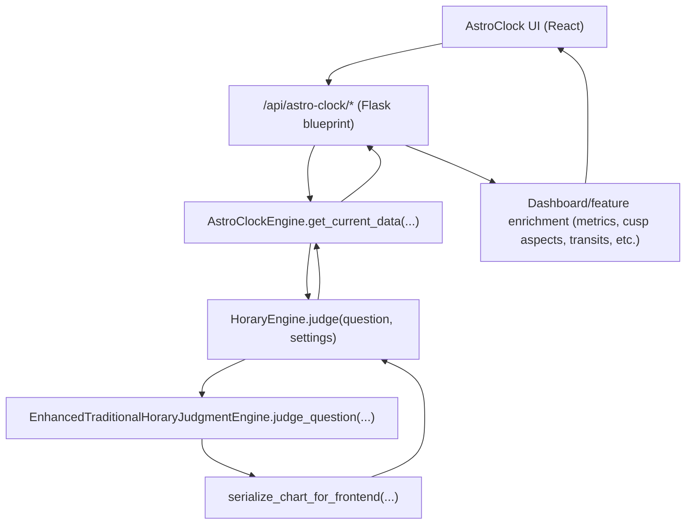

# Horary Engine and AstroClock Engine Workflow

## Scope

This document explains how the AstroClock stack uses the Horary engine at runtime, what data is exchanged, and how this path differs from the regular `/api/calculate-chart` flow.

Primary source files:

- `backend/horary_engine/engine.py`
- `backend/horary_engine/serialization.py`
- `backend/astro_clock_engine.py`
- `backend/astro_clock_api.py`
- `backend/app.py`
- `frontend/src/features/astroclock/api.mjs`
- `frontend/src/features/astroclock/AstroClock.jsx`

## Component Roles

- `HoraryEngine`:
  - Public method: `judge(question, settings)`.
  - Produces full horary result: judgment, confidence, reasoning, `chart_data`, timing, factors, timezone info.
- `AstroClockEngine`:
  - Stateful wrapper used by Astro Clock endpoints.
  - Converts Astro Clock mode/time/location into a Horary `settings` payload.
  - Calls `HoraryEngine.judge(...)`, then derives clock-oriented fields (`moon_state`, `dispositor_chains`, `current_aspects`).
- `astro_clock_api` blueprint:
  - Owns singleton `AstroClockEngine`.
  - Exposes `/api/astro-clock/*` endpoints.
  - Normalizes/enriches Horary output for dashboard/transits/forensic/election/research features.

## High-Level Runtime Sequence

## Integration Contract: AstroClockEngine -> HoraryEngine

`AstroClockEngine._generate_chart_with_horary_engine(...)` is the adapter layer.

It always calls Horary using:

- `question = "Astro Clock Real-time Chart"` (fixed placeholder)
- `settings.location = AstroClockSettings.location or "Greenwich, UK"`
- `settings.use_current_time` based on AstroClock mode:
  - `REALTIME`: `true`
  - `MANUAL`: `false` + explicit `date` and `time`
- `settings.timezone = AstroClockSettings.timezone`
- `settings.house_system_code = AstroClockSettings.house_system_code`
- `settings.manual_houses = None`
- Override flags forced for clock mode:
  - `ignore_radicality = true`
  - `ignore_void_moon = true`
  - `ignore_combustion = true`
  - `ignore_saturn_7th = true`
  - `exaltation_confidence_boost = 0.0`

Why this matters:

- AstroClock is using Horary mainly as a chart computation engine and data source, not as strict query adjudication.
- Clock views are not gated by radicality/void/combustion checks that are relevant for direct horary judgment UX.

## Horary Output Used by AstroClock

Horary returns a full result dict. AstroClock consumes mostly:

- `chart_data` (serialized by `serialize_chart_for_frontend`):
  - `planets` (dict keyed by planet name)
  - `aspects` (list with orb/applying/exact metadata)
  - `houses`, `house_rulers`, `ascendant`, `midheaven`
  - `solar_conditions_summary`
  - `timezone_info`
  - optional `moon_last_aspect`, `moon_next_aspect`
  - optional `house_system_code`
- Top-level fallback fields (used in API enrichment when needed):
  - `considerations.moon_void`
  - `moon_next_aspect`

AstroClockEngine then derives:

- `moon_state` from moon position + void status
- `dispositor_chains` from planet signs
- `current_aspects` from top-level `aspects` (or `chart_data.aspects` fallback)

## AstroClock API Enrichment Layer

`astro_clock_api._serialize_real_time(...)` and `_build_dashboard_payload(...)` convert Horary payload into UI-focused data:

- normalize `planets` shape (dict/list -> list)
- robust Moon VoC detection fallback order:
  1. `moon_state.void_of_course`
  2. `chart_data.considerations.moon_void` (if present)
  3. top-level `result.considerations.moon_void`
- aspect summaries (`tightest_aspect`, `top_aspects`)
- fixed stars, Arabic lots, sect
- cusp aspects
- metrics
- dispositors
- optional Morin payloads when requested

## Stateful vs Stateless Paths

There are two AstroClock usage patterns of Horary computation:

1. Stateful clock path:
   - Endpoints like `/dashboard`, `/current`, `/snap`, `/receptions`, `/compass`.
   - Use singleton `AstroClockEngine` current settings (`mode`, location, timezone, house system).
2. Scoped/stateless chart derivation path:
   - Helper `_compute_chart_for(...)` builds temporary `AstroClockSettings`.
   - Calls `eng.get_current_data(settings=local)` without permanently mutating engine state.
   - Used by transits/predictor/context/election/research calculations.

## `/api/calculate-chart` vs AstroClock Horary Usage

Regular horary endpoint (`/api/calculate-chart` in `app.py`):

- Takes user question/location/date/time directly.
- Uses user-provided override flags.
- Returns full decision payload for horary reading UX.
- Adds extra `calculation_metadata`, ledger/rationale packaging in API layer.

AstroClock path:

- Uses placeholder question.
- Forces permissive override flags for stable chart availability.
- Focuses on chart telemetry and downstream analytic features.
- Applies additional normalization/enrichment in `astro_clock_api`.

## Endpoint Trigger Flow (Frontend -> Backend)

- UI mode/time/location controls call `/api/astro-clock/mode`.
- Realtime updates:
  - UI opens `/api/astro-clock/stream` heartbeat SSE.
  - Each heartbeat triggers dashboard fetch `/api/astro-clock/dashboard`.
- Advanced features (transits/election/forensic/research) call dedicated endpoints that internally compute charts via `_compute_chart_for(...)`.

## Practical Change Checklist

When changing either engine, verify these contracts:

- `HoraryEngine.judge(...)` still accepts `settings` keys used by `AstroClockEngine`.
- `chart_data` keeps `planets/aspects/houses/house_rulers/timezone_info` structure.
- Moon-related fields remain available either in `chart_data` or top-level fallback paths.
- `planets` can be normalized safely if structure changes (dict vs list).
- If override semantics change, confirm AstroClock forced flags still produce intended non-gating behavior.

