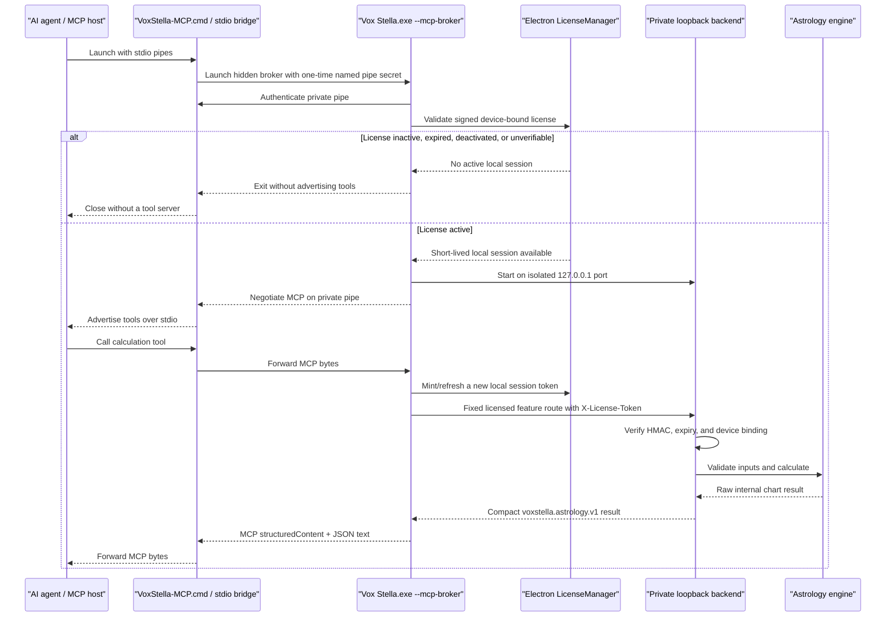

# Vox Stella licensed MCP architecture

Status: core implemented on 2026-08-01; licensed AstroClock feature suite expanded on 2026-08-02.

## Purpose

Vox Stella exposes licensed, read-only AstroClock calculations to local AI agents through Model Context Protocol (MCP). The contract includes core charts and planetary hours plus Synastry, Trait Profile, Transits, Astrocartography, Election, Chinese Astrology, Forensic, and Birth-time Certification. It does not expose durable license credentials, arbitrary backend routes, saved-data browsing, or mutation tools.

The non-negotiable access invariant is:

> If the installed Vox Stella application cannot establish an active license for its current device, it must not initialize an MCP tool server and it must not perform an MCP calculation.

The MCP client configuration is not a credential. Copying it to another computer, another Windows account, or an unlicensed installation does not grant access.

## Standards baseline

The implementation uses the stable `@modelcontextprotocol/server` 2.0.0 package and its `serveStdio` entry. This supports the current MCP 2026-07-28 protocol and retains the SDK's 2025-era fallback for clients that have not migrated.

The transport follows the official MCP stdio requirements: the client launches the server, protocol messages use stdin/stdout, and all non-protocol logging goes to stderr. See:

- [MCP 2026-07-28 specification](https://modelcontextprotocol.io/specification/2026-07-28)
- [Official TypeScript SDK server documentation](https://github.com/modelcontextprotocol/typescript-sdk/blob/main/docs/server.md)
- [Official 2026-07-28 stdio migration guidance](https://github.com/modelcontextprotocol/typescript-sdk/blob/main/docs/migration/support-2026-07-28.md)

## Runtime flow



## License enforcement

Enforcement is deliberately split across two processes.

### Electron gate

Electron is the only process that reads encrypted durable license state. In MCP mode it:

1. Initializes the same `LicenseManager` used by the desktop application.
2. Validates the packaged license trust root and device identity.
3. Calls `getStatus()` and `getToken()` before starting the backend or advertising MCP tools.
4. Calls `getToken()` again immediately before every resource read or tool call.
5. Returns a neutral `license_required` error when the license expires, is deactivated, or requires verification.

The token returned by `getToken()` is not the durable signed activation token. It is an opaque HMAC session scoped to the local backend, bound to the device, and capped to five minutes by both Electron and Python. The present Electron default is 180 seconds.

### Windows stdio bridge

Packaged Electron is a Windows GUI-subsystem executable and does not reliably retain stdin when launched directly by an MCP host. The installer therefore places `VoxStella-MCP.cmd` next to `Vox Stella.exe`. It runs the same signed Electron runtime in Node mode as a small console bridge, then launches a hidden normal Electron broker.

The two processes communicate through a random per-launch Windows named pipe authenticated by a 256-bit one-time secret delivered only in the broker child's environment and deleted after startup validation. The bridge only forwards MCP bytes and never reads license storage or receives a backend license token. Electron still performs the license-first startup and per-call token minting. MCP logs remain on stderr.

The bridge allows 180 seconds for the licensed broker to connect. This covers license initialization, all three packaged backend readiness attempts (up to 45 seconds each), and the final pipe connection. Client examples use a 210-second startup timeout so the host does not expire first.

### Backend gate

All `/api/mcp/*` routes are included in `PROTECTED_ENDPOINT_PREFIXES`. Flask rejects a request before its route handler when the local session is missing, malformed, expired, overlong, or bound to another device.

The backend binds only to `127.0.0.1`. The MCP bridge can call `/api/mcp/*` and a finite table of read-only AstroClock feature routes. Each feature entry fixes the allowed HTTP method, query-key set, response framing, and maximum timeout. There is no caller-controlled backend path. The client parses and canonicalizes the base URL and final request URL before minting or attaching a local license session. It rejects credentials, non-loopback hosts, missing or invalid ports, caller-supplied query strings, fragments, encoded traversal, undeclared routes, wrong methods, unknown query keys, oversized URLs, and timeouts above five minutes.

MCP request cancellation is propagated from the SDK handler context into the local HTTP request. Cancellation destroys the pending bridge request immediately instead of waiting for its route-specific deadline; bounded feature scans may allow up to five minutes.

### Development behavior

The desktop UI's existing source-mode convenience bypass does not apply to `--mcp`. Source-mode MCP explicitly disables `ALLOW_DEV_LICENSE_BYPASS` and `LICENSE_BYPASS` in the backend child. Tests use dependency injection and temporary HMAC sessions instead of a production bypass.

## Exposed MCP contract

### Tools

| Tool | Purpose | Time behavior |
| --- | --- | --- |
| `get_astrological_capabilities` | Returns supported schema, bodies, sections, house systems, and required inputs | Stable for an installed build |
| `calculate_astrological_chart` | Calculates a chart for an explicit ISO-8601 time and location | Deterministic for identical inputs and engine data |
| `get_current_astrological_positions` | Calculates positions for the current instant | Time-varying |
| `calculate_planetary_hours` | Calculates 24 unequal planetary hours for the selected local date | Deterministic when `datetime` is supplied |
| `analyze_synastry` | Compares two explicit charts through the selected Synastry engine | Deterministic; never reads or creates saved charts |
| `calculate_trait_profile` | Runs the complete Trait Profile for an explicit natal chart | Deterministic |
| `analyze_transits` | Calculates exact transits to an explicit natal chart | Deterministic for explicit timestamps |
| `scan_transit_window` | Scans a bounded transit window | Deterministic for identical inputs and engine data |
| `analyze_astrocartography_location` | Evaluates one exact target location | Deterministic |
| `generate_astrocartography_map` | Produces global line data | Deterministic |
| `compare_astrocartography_locations` | Compares two through ten explicit targets | Deterministic |
| `search_astrocartography_atlas` | Ranks bounded atlas candidates | Deterministic for identical catalog data |
| `find_election_times` | Returns top candidates from a bounded Election scan | Deterministic for explicit bounds and engine data |
| `calculate_bazi` | Calculates an explicit Four Pillars profile | Deterministic |
| `analyze_chinese_compatibility` | Compares two explicit BaZi birth profiles | Deterministic; never requires saved charts |
| `cast_iching_oracle` | Casts coins, yarrow probabilities, or manual lines | Non-idempotent unless manual lines or a seed are supplied |
| `analyze_forensic_event` | Runs the Forensic rule engine for an explicit event chart | Deterministic; symbolic analysis only |
| `run_birth_time_certification` | Runs bounded rectification and evidence-quality classification | Deterministic; not documentary certification |

Every tool is read-only and non-destructive. Calculation tools use Zod validation in the MCP server and the canonical Python route or service repeats domain validation. Scan tools have explicit range, row, result, response-size, and timeout bounds.

### Resources

| URI | Content |
| --- | --- |
| `voxstella://capabilities` | Versioned supported-parameter contract |
| `voxstella://engine/version` | Installed app version, calculation schema version, and license requirement |

Resource reads are licensed calls too; they mint a fresh local backend session.

### Required location inputs

Western chart-based calculation tools require:

- `latitude`: decimal degrees from -90 through 90
- `longitude`: decimal degrees from -180 through 180, east positive
- `timezone`: a valid IANA timezone such as `America/Los_Angeles`

`location` is an optional human-readable label. Coordinates are authoritative. Requiring coordinates and timezone prevents silent Greenwich defaults, network geocoding ambiguity, and daylight-saving errors.

`calculate_astrological_chart` additionally requires `datetime`. It accepts ISO-8601 timestamps with offsets. A timestamp without an offset is interpreted as local civil time in the supplied IANA timezone, with nonexistent daylight-saving wall times rejected.

A date without a time component is rejected. Vox Stella never silently interprets `YYYY-MM-DD` as midnight because that produces a plausible but unintended chart.

### House systems

The default is Regiomontanus (`R`). Supported codes are:

| Code | System |
| --- | --- |
| `R` | Regiomontanus |
| `P` | Placidus |
| `E` | Equal |
| `W` | Whole Sign |
| `O` | Porphyry |
| `C` | Campanus |
| `K` | Koch |
| `T` | Topocentric |

### Bodies and sections

The default body set is Sun, Moon, Mercury, Venus, Mars, Jupiter, Saturn, and North Node. Optional bodies are Uranus, Neptune, Pluto, and Chiron. Selecting an optional body automatically enables its engine calculation.

Selectable response sections are `metadata`, `angles`, `planets`, `houses`, `aspects`, `moon`, and `considerations`. Aspect rows are filtered so both bodies are in the requested body set.

Core chart responses use `voxstella.astrology.v1`. Expanded feature responses carry `mcp_schema_version: voxstella.features.v1` and the invoking `feature_tool`. Numeric values remain machine-readable; internal engine objects and license claims are not returned.

## Client configuration

On Windows, use the installed `VoxStella-MCP.cmd` launcher directly as the MCP command. Do not wrap it in `cmd.exe /c`: several Node-based MCP hosts escape embedded quotes literally when the installation path contains spaces. Do not point a client directly at `Vox Stella.exe` because a GUI-subsystem process may lose stdin, and do not point it at `horary_backend.exe`; direct backend access has no durable-license authority and is intentionally rejected.

The installed application exposes the tested configuration in **Settings → Model Context Protocol (MCP)**. That surface reports launcher/license readiness, lists the exact tools, copies JSON or Codex configuration, opens the launcher folder, and documents the data boundary.

Replace the command with the actual installation path chosen by the user.

### JSON-style MCP clients

```json
{
  "mcpServers": {
    "vox-stella": {
      "command": "C:\\Users\\YOUR_USER\\AppData\\Local\\Programs\\Vox Stella\\VoxStella-MCP.cmd"
    }
  }
}
```

### Codex TOML

```toml
[mcp_servers.vox_stella]
command = "C:\\Users\\YOUR_USER\\AppData\\Local\\Programs\\Vox Stella\\VoxStella-MCP.cmd"
startup_timeout_sec = 210
tool_timeout_sec = 300
```

Activate Vox Stella normally in the desktop application before the first MCP launch. Closing the desktop window does not remove the encrypted activation. MCP can also run while the desktop UI is open because MCP processes intentionally do not join the UI single-instance lock.

## Error contract

| Condition | Behavior |
| --- | --- |
| No active license at startup | Process exits before tool advertisement |
| License expires or is deactivated after startup | The next call fails with a neutral license error |
| Missing/invalid backend session | Backend returns HTTP 402/403; Electron maps it to `license_required` |
| Bad coordinates, timezone, time, body, section, or house code | Tool error with a bounded correction message |
| Calculation failure | Tool error without license token or internal object disclosure |
| Oversized/partial/non-JSON backend response | Bounded bridge error and aborted request |

## Source map

| Source | Responsibility |
| --- | --- |
| `frontend/main.js` | `--mcp-broker` headless lifecycle, license-first startup, private pipe, and backend lifetime |
| `frontend/main/license.js` | Encrypted durable token ownership and local session minting |
| `frontend/main/mcp/server.js` | Core MCP v2 tools, resources, and stdio era negotiation |
| `frontend/main/mcp/feature-tools.js` | Typed, read-only feature tools and fixed route adapters |
| `frontend/main/mcp/licensed-backend-client.js` | Fresh-token-per-call policy, exact feature allowlist, and Election SSE completion framing |
| `frontend/main/mcp/setup.js` | Quote-safe client configuration, readiness state, and advertised scope |
| `frontend/main/mcp/stdio-bridge.js` | Windows console stdio to authenticated named-pipe proxy |
| `frontend/packaging/VoxStella-MCP.cmd` | Installed MCP launcher |
| `frontend/main/backend-http.js` | Deadline, response-size, GET/POST JSON and bounded text transport |
| `frontend/src/components/McpIntegrationSection.jsx` | Customer-facing Settings setup, status, tools, and privacy boundary |
| `backend/app.py` | Global license middleware and MCP blueprint registration |
| `backend/mcp_api.py` | Private licensed HTTP routes |
| `backend/mcp_chart_service.py` | Public input validation, engine invocation, compact versioned output |
| `backend/mcp_feature_service.py` | Explicit-input, storage-independent Synastry adapter |

## Verification and release gates

Run the focused tests:

```powershell
python -m pytest -q backend/test_mcp_chart_service.py backend/test_mcp_feature_service.py backend/test_mcp_api.py backend/test_planetary_hours.py
Set-Location frontend
node --test tests/electronRuntimeSecurity.test.cjs tests/mcpServer.test.cjs
npx vitest run --config vitest.config.mjs src/tests/mcpIntegrationSection.test.jsx

Set-Location ..\website-source
npm run test:mcp
```

The test coverage includes:

- a fixed Jerusalem chart with known engine positions;
- parameter boundaries and required location context;
- complete 24-hour planetary-hour output;
- missing, expired, and valid device-bound local license sessions;
- a fresh session token on every backend call;
- no token detail in MCP license errors;
- Zod rejection before backend invocation;
- MCP tools/resources through an in-memory client;
- valid minimal explicit inputs for all 14 feature tools;
- exact feature route, method, and query-key allowlisting;
- Election SSE completion extraction and cancellation;
- explicit Synastry with no saved-chart access;
- explicit Chinese Compatibility without saved snaps;
- a real child-process stdio negotiation proving the 2026 protocol path while legacy fallback remains enabled;
- a Windows console-bridge round trip through an authenticated private broker pipe;
- direct `.cmd` startup through the official Node MCP client;
- canonical URL and path-boundary rejection before token minting;
- cancellation of an in-flight backend request;
- date-only timestamp rejection;
- rendered Settings setup and copy interactions; and
- public Streamable HTTP protocol-version and server-card conformance.

Before a release, also run the full backend/frontend suites, package only through `package-app-new.bat`, then test the packaged executable in these states:

1. Licensed installation: tools list and a known chart call succeed.
2. Desktop UI already open: a separate MCP process succeeds.
3. Unlicensed clean user-data directory: process exits without tools.
4. Deactivated or expired license during an open MCP session: next call fails.
5. Captured stdout: every line is valid MCP protocol data; diagnostics appear only on stderr.

## Deliberate non-goals

- No remote Streamable HTTP endpoint for the licensed calculation engine. The separate website endpoint exposes public discovery resources only.
- No API keys separate from the Vox Stella device license.
- No activation, purchase, deactivation, or license-status tools.
- No file, notebook, note, or saved-chart browsing. A specialized Election model may consume an explicit saved-chart ID supplied by the user, but MCP cannot enumerate those IDs.
- No chart mutation, horary judgment, factual crime determination, or suspect-identification tools.
- No durable tokens, license IDs, device IDs, emails, or customer identity in MCP results.

Future tools should reuse the same license-first startup, per-call token minting, fixed route/method/query allowlist, strict input schema, bounded computation, and compact versioned output pattern.
