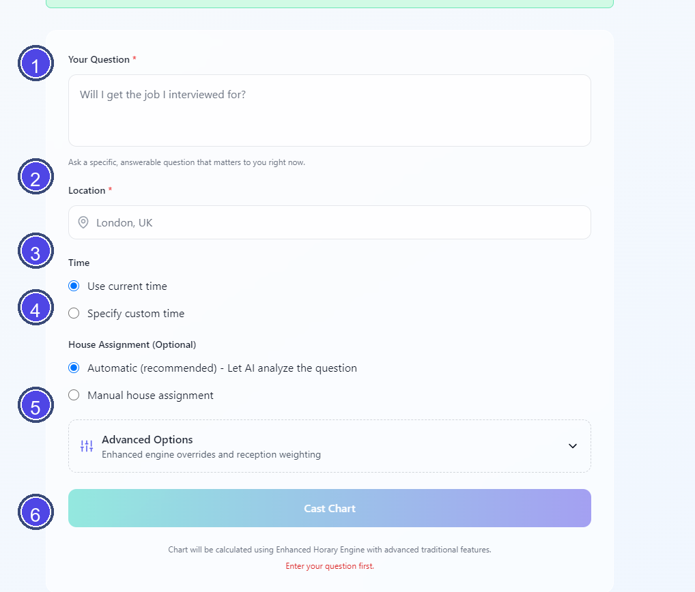

# Vox Stella Cast A Chart Guide

Use the Cast Chart screen to enter the question, place, and timing details for a horary chart.

## Screen At A Glance

Figure 1. Cast a chart screen.

Legend

1. Question field
2. Location field
3. Time mode selector
4. House assignment selector
5. Advanced options panel
6. Cast Chart button

## Before You Cast

- In the packaged desktop app, horary casting requires activation.
- If the horary engine is connected, the screen shows **Horary Engine Available**.
- If the API is offline, the screen warns that a demo chart will be created and saved locally instead of a live calculation.
- The **Cast Chart** button stays disabled until the required inputs are present.

## Required Fields

### Your Question

Enter a clear, specific horary question. The screen expects a question that is answerable and relevant now.

### Location

Enter the place for the chart. The form offers simple location suggestions while typing.

## Time Options

You can cast using either:

- **Use current time**
- **Specify custom time**

If you choose custom time:

- both **Date** and **Time** are required
- the timezone controls appear in this mode
- the app converts the chosen date into the format expected by the backend
- the timezone is auto-detected from the location unless you switch to manual override

### Timezone

- **Auto-detected** uses the current location input.
- **Manual Override** lets you choose a timezone from the built-in list.

## House Assignment

House assignment is optional.

- **Automatic (recommended)** lets the app analyze the question and assign houses.
- **Manual house assignment** lets you enter houses as comma-separated numbers.

At minimum, a manual house entry must include the querent and quesited houses. Example:

- `1,7` for querent and partner or opponent

Common examples shown in the UI:

- `1,2` for money
- `1,5` for children
- `1,10` for career
- `1,4` for home

## Advanced Options

Advanced options appear only when the horary engine is connected.

They currently include:

- **Override Radicality Warnings**
- **Override Void Moon Warnings**
- **Override Combustion Penalties**
- **Override Saturn 7th Warnings**
- **Exaltation Confidence Boost**

These options change how the enhanced horary engine handles traditional restrictions and reception weighting. They are not general-purpose defaults.

## What Happens When You Click Cast Chart

When you click **Cast Chart**:

- the app validates the required fields
- if the engine is connected, it sends the request to the horary backend and opens the result screen
- if the engine is offline, it creates a demo chart and opens that instead

## Practical Tips

- Use a precise question instead of a broad topic.
- Use custom time only when you want a specific historical or controlled chart time.
- Leave house assignment on automatic unless you already know which houses you want the engine to use.
