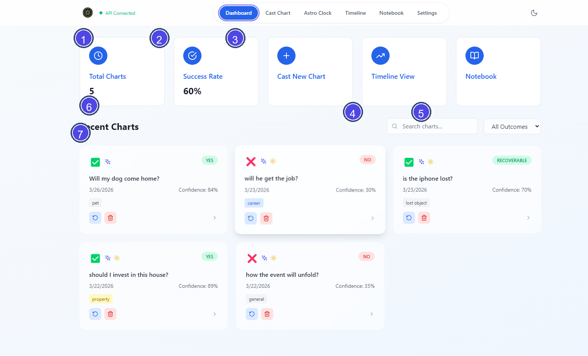

# Vox Stella Dashboard Guide

Use the Dashboard to review saved horary charts, reopen earlier work, and move into the main horary tools.

## Screen At A Glance

Figure 1. Dashboard overview.

Legend

1. Total Charts summary card
2. Success Rate summary card
3. Action cards for core navigation
4. Search field
5. Outcome filter
6. Recent Charts heading
7. Example saved chart card

## What You Can Do Here

The Dashboard is the main home screen for saved horary charts in the current app installation. It shows summary cards across the top and saved charts underneath.

## Top Cards

- **Total Charts** shows how many charts are currently saved locally.
- **Success Rate** shows the percentage of saved charts whose judgment is `YES`.
- **Cast New Chart** opens the horary casting screen.
- **Timeline View** opens the chart timeline.
- **Notebook** opens the notes-focused chart view.

## Recent Charts

The Recent Charts section lets you browse, filter, and reopen saved charts.

- Use **Search charts...** to search by the chart question or querent name when available.
- Use the outcome filter to switch between `All Outcomes`, `Positive`, `Negative`, and `Uncertain`.
- If no saved charts match the current search or filter, the dashboard shows an empty-state message.

## What Each Chart Card Shows

Each chart card can include:

- the original horary question
- the saved date
- the verdict badge
- the confidence percentage
- up to two tags, plus a `+N more` indicator when more tags exist
- an enhanced-analysis indicator when enhanced engine features were used
- a solar-conditions indicator when solar condition data is present

If the app is not activated, the verdict area is shown as `Locked`.

## Actions From A Chart Card

- Click the card to open the full horary analysis workspace.
- Use the **rerun** button to recalculate the chart using the original saved question, location, and chart time when that source timing is available.
- Use the **delete** button to remove the chart from local storage.

## Notes

- Saved charts are stored locally on this device or browser profile.
- The dashboard is a saved-chart workspace, not a cloud account dashboard.
- If there are no saved charts yet, the dashboard offers a direct button to cast the first chart.
