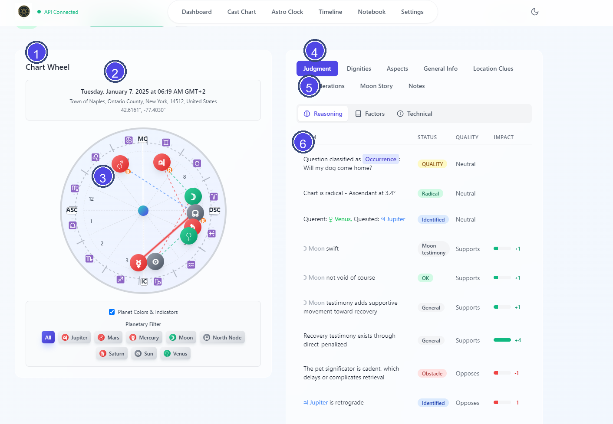
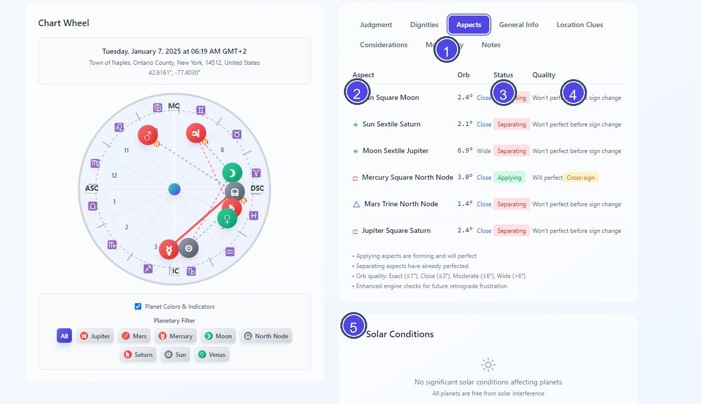

# Vox Stella Horary Workspace Guide

This is the main chart-reading workspace that opens after you cast a chart or select one from the Dashboard.

## Screen At A Glance

Figure 1. Horary workspace overview.

Legend

1. Chart wheel panel
2. Chart date, time, and location summary
3. Wheel and planet display area
4. Main analysis tabs
5. Judgment sub-tabs
6. Active analysis content

Figure 2. Aspects tab example.

Legend

1. Active main tab
2. Aspect list
3. Applying or separating status
4. Perfection or cross-sign notes
5. Solar Conditions panel

## Header Area

At the top of the workspace you will see:

- the horary question
- the verdict and confidence gauge when the app is activated
- badges such as `Enhanced`, `Solar Conditions`, and `Demo Chart` when they apply

If the app is not activated, the header shows a notice instead of the verdict.

## Header Actions

The action buttons in the top-right require activation.

- **Share chart** uses the system share sheet when available, or copies share text plus chart data to the clipboard.
- **Analyze with AI** copies a structured horary-analysis prompt to the clipboard for use in an external AI assistant.
- **Download JSON** exports the chart data, metadata, and notes as a JSON file.

## Chart Wheel

The left side of the workspace shows the chart wheel. It renders the houses, planets, aspects, and solar-condition styling for the current chart.

## Main Analysis Tabs

The right side of the workspace contains the main analysis tabs.

### Judgment

The Judgment tab is split into three sub-tabs:

- **Reasoning** shows the judgment breakdown and the final confidence arch.
- **Factors** shows the houses examined, the querent and quesited rulers when present, traditional factors such as perfection or reception, and any timing text returned with the chart.
- **Technical** shows chart details such as the Ascendant, house system, engine version, and demo status when applicable.

If advanced override flags were used during casting, the Judgment tab shows a banner explaining which traditional restrictions were bypassed.

### Dignities

The Dignities tab lists each planet with:

- sign
- house
- dignity label
- dignity score
- a strength bar
- a retrograde marker when applicable

### Aspects

The Aspects tab lists the major chart aspects with:

- the two planets involved
- aspect type
- orb
- applying or separating status
- perfection notes, including cross-sign warnings when relevant

### General Info

The General Info tab shows:

- planetary day
- planetary hour
- Moon phase
- Moon mansion
- Moon condition, including void-of-course status
- end-of-matter information from the 4th house cusp and planets in the 4th house

### Location Clues

The Location Clues tab appears only for supported location-type horary charts, such as lost-object or missing-pet style cases.

### Considerations

The Considerations tab shows the chart's traditional caution flags, including:

- radicality
- Moon void-of-course status

When the chart is non-radical, the panel explains the specific issue and shows extra context for cases such as early Ascendant, late Ascendant, Saturn in the 7th, or Via Combusta.

### Moon Story

The Moon Story tab focuses on the Moon and currently shows:

- the Moon's sign, house, speed, and dignity score
- void-of-course status
- current Moon aspects
- projected future Moon aspects over the next 30 days

### Notes

The Notes tab lets you write and save chart notes for the current chart. These notes are stored locally.

## Solar Conditions Panel

When solar-condition data is available, a separate panel appears below the tab area. It can show:

- **Cazimi**
- **Combusted**
- **Under the Beams**

If no significant solar conditions are present, the panel says so explicitly.

## Activation Behavior

The tab bar remains visible even when the app is not activated, but the detailed analysis area is masked until activation is completed.
