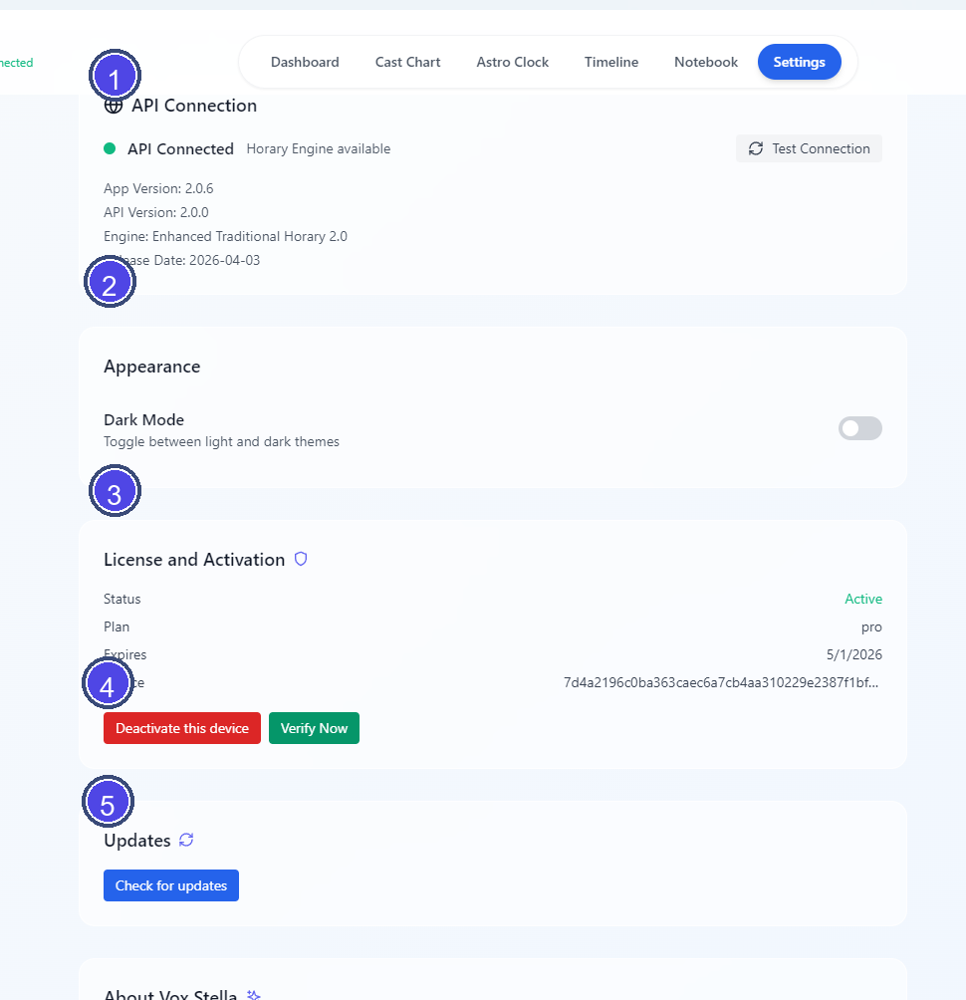

# Vox Stella Settings Guide

Use Settings to check connection status, manage activation, control appearance, and handle app updates.

## Screen At A Glance

Figure 1. Settings overview.

Legend

1. API Connection section
2. Appearance section
3. License and Activation section
4. Activation and verification controls
5. Updates section

## API Connection

The API Connection section shows the current backend status.

When available, it displays:

- whether the API is connected
- the current app version
- the backend API version
- the horary engine version
- the release date

Use **Test Connection** to check the current backend connection again.

## Appearance

The Appearance section currently includes **Dark Mode**.

Use this toggle to switch between the light and dark app themes.

## License And Activation

The License and Activation section changes depending on the current license state.

### If The App Is Activated

The section can show:

- status
- plan
- expiry date when the current license includes one
- device identifier

Available actions can include:

- **Deactivate this device**
- **Verify Now**

### If The App Is Not Activated

The section shows fields for:

- **License Key**
- **Email (optional)**

Available actions can include:

- **Activate**
- **Verify Now**
- **Purchase License**

## Updates

Use **Check for updates** to ask the desktop app to check for a new version.

If an update finishes downloading, Settings can also show **Restart to update**.

## About Vox Stella

The About section summarizes the current app environment, including:

- app version
- backend API version
- engine name
- ephemeris source
- default house-system information
- enhanced feature summary
- listed classical sources
