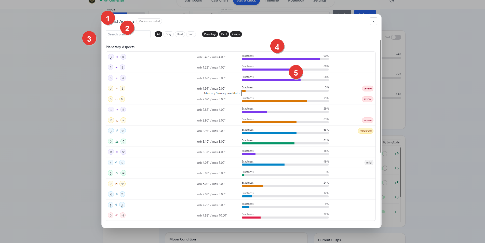

# Vox Stella Astro Clock Aspect Analysis Guide

Use Aspect Analysis to inspect the current Astro Clock aspect picture in more detail than the small Current Aspects card can show.

## When To Use It

Open Aspect Analysis when you want to:

- inspect more than the top few current aspects
- filter the aspect list by conjunctions, hard aspects, or soft aspects
- search for a specific planet pairing
- review declination or antiscia-style relationships
- inspect cusp contacts alongside planetary aspects

Aspect Analysis reads the active Astro Clock chart. If you want it to analyze a specific saved chart, load that saved snap into Astro Clock first.

## How To Open It

In Astro Clock, use the `More` button in the `Current Aspects` card.

The modal reflects the current Astro Clock analysis mode:

- in the standard mode, the main list is shown as planetary aspects and declinations
- in Morin mode, the same workspace shifts to Morin-oriented labels such as `Morin Aspects` and `Antiscia / Contra-antiscia`

## Screen At A Glance

Figure 1. Aspect Analysis modal.

Legend

1. Modal title and close control
2. Search field and aspect-family filters
3. Main section heading for the current aspect list
4. Exactness meter for each row
5. Row status chips, such as phase or severity

## Main Controls

The top filter row controls which aspect rows are shown.

- `Search planet...` filters by the planet names shown in each row
- `All`, `Conj`, `Hard`, and `Soft` restrict the aspect family
- `Planetary`, `Decl`, and `Cusps` turn the main reading groups on or off

The current chart can therefore be narrowed quickly without leaving the modal.

## What The Lists Show

### Planetary Or Morin Aspects

The first section shows the main aspect list for the active chart.

- Rows are sorted by tighter orb first.
- Each row shows the two bodies, the aspect, the current orb, the maximum allowed orb, and an exactness bar.
- Depending on the active mode, rows can also show phase, direction, partile or platic state, or severity chips.

This is the main place to inspect which aspects are actually driving the current Astro Clock reading.

### Declination Or Morin Antiscia

The second section changes label depending on the active mode.

- In the standard mode, it shows declination relationships such as parallel and antiparallel.
- In Morin mode, it surfaces antiscia and contra-antiscia style relationships.

Use this section when the main planetary list is not enough and you want the secondary relationship layer.

### Cusp Aspects

When the `Cusps` toggle is enabled, the modal also shows cusp-related contacts.

This is useful when you need to inspect contacts to house cusps without treating them as ordinary planetary aspects.

## Reading A Row

Each row is meant to answer three questions quickly:

1. which bodies or points are involved
2. how tight the contact is
3. whether the row is more exact, less exact, or specially flagged

The orb and exactness bar are the main ranking cues. Tighter rows appear earlier and carry a fuller exactness bar.

## Practical Workflow

For a clean Astro Clock workflow:

1. load the chart you want to inspect
2. open `More` from the Current Aspects card
3. search for a planet or reduce the list to `Conj`, `Hard`, or `Soft`
4. turn `Decl` or `Cusps` on when you need a broader structural view
5. close the modal and return to the main workspace when you are done

## Notes

- Aspect Analysis does not create a saved snap by itself.
- It always reads the current active Astro Clock chart.
- Loading a saved snap first is the easiest way to make the modal analyze an earlier chart instead of the live one.
