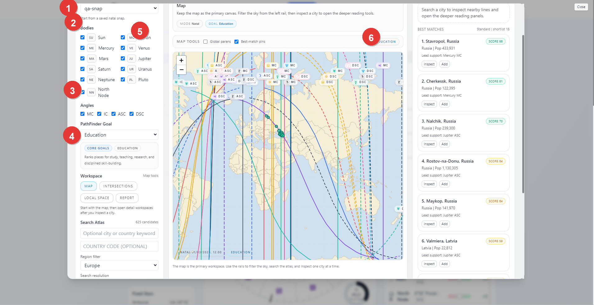
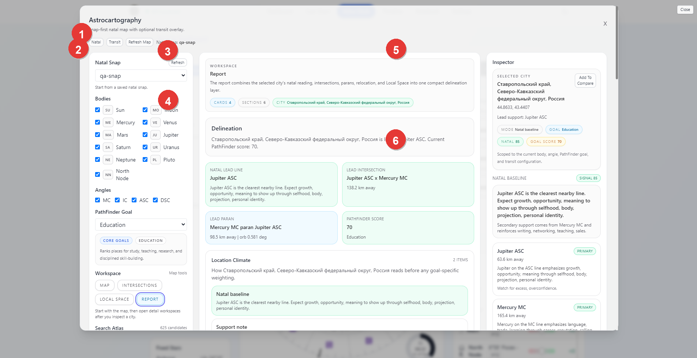

# Vox Stella Astro Clock Astrocartography Guide

Use Astrocartography to start from a saved natal snap, inspect the world map, search for high-signal cities through a PathFinder goal, and open a deeper report for a selected location.

## Related Guides

- [Astrocartography PathFinder Guide](VOX_STELLA_ASTRO_CLOCK_ASTROCARTOGRAPHY_PATHFINDER_GUIDE.md)
- [Saved Snaps Guide](VOX_STELLA_ASTRO_CLOCK_SAVED_SNAPS_GUIDE.md)
- [Astro Clock Guide](VOX_STELLA_ASTRO_CLOCK_GUIDE.md)

## Before You Start

Astrocartography is snap-first in the current app.

- A saved natal snap is required.
- If you do not already have one, the modal can save the current Astro Clock chart as your first natal snap.
- Transit mode overlays time-sensitive lines on top of the natal base and does not replace the natal map.

## Screen At A Glance

Figure 1. Astrocartography map workspace.

Legend

1. Natal snap selector
2. Body and angle filters
3. PathFinder Goal chooser
4. Workspace tabs and Search Atlas controls
5. Map canvas and map tools
6. Best Matches rail

## Starting The Workspace

The usual starting flow is:

1. choose a saved natal snap
2. decide whether you are working in natal mode or transit mode
3. choose the bodies and angles you want to inspect
4. choose a PathFinder goal if you want ranked city results
5. use the map directly or run atlas search

If you open the modal before any natal snap exists, the setup screen lets you save the current Astro Clock chart as a snap and return to the workspace.

## Natal Snap And View Mode

The selected natal snap is the base chart for the entire workspace.

The top controls let you switch between:

- `Natal`
- `Transit`

When `Transit` is active, the modal adds an overlay chart context on top of the natal base. The transit chart can use the live current time or manual date and time fields, plus an optional transit location and time zone.

## Body And Angle Filters

The left rail lets you decide which lines are in view.

- Bodies can be turned on or off individually.
- Angles such as `MC`, `IC`, `ASC`, and `DSC` can be turned on or off.

Use these filters before running atlas search when you want the map and results to reflect only the lines that matter for the question.

## PathFinder Goal

The PathFinder Goal control changes how ranked city results are scored.

- `General inspection` keeps the reading neutral.
- A specific goal changes the ranking lens to a defined theme such as education, career, or other supported families.

In the current UI, atlas ranking is goal-driven. If you want the `Search Best Cities` path, choose a goal first.

## Search Atlas

The Search Atlas panel lets you search the location catalog through the current goal and filter set.

You can set:

- an optional city or country keyword
- an optional country code
- a region filter
- a search resolution

When you click `Search Best Cities`, the right rail fills with ranked matches for the current goal and filter set.

Use the dedicated [Astrocartography PathFinder Guide](VOX_STELLA_ASTRO_CLOCK_ASTROCARTOGRAPHY_PATHFINDER_GUIDE.md) when you want the deeper goal-family, region-filter, progress-session, and shortlist workflow.

The best-matches rail shows:

- ranked locations
- a score badge
- a short lead support line
- `Inspect` and `Add` actions

`Inspect` opens the selected city in the deeper reading workspace.

## Workspace Tabs

The main Astrocartography workspace includes:

- `Map`
- `Intersections`
- `Local Space`
- `Report`

The intended order is to start with `Map`, inspect a city, and then move into the deeper tabs once you have a location worth studying.

## Report Workspace

Figure 2. Astrocartography report workspace.

Legend

1. Natal or Transit mode bar and refresh controls
2. Natal snap and filter rail
3. Report workspace header
4. Delineation and support cards
5. Inspector summary for the selected city
6. Detailed line-reading cards

The `Report` tab is the compact synthesis view for a selected city.

It combines the selected location's reading into one place, including:

- the city summary
- the main delineation
- lead-line or intersection support
- goal score or PathFinder framing
- inspector details for the selected city
- the supporting line cards shown in the right rail

This is the workspace to use when you want a readable, compact location summary instead of a raw map-first view.

## Practical Workflow

For most users, the cleanest Astrocartography workflow is:

1. save or load the natal snap you want to use
2. open Astrocartography
3. choose the working bodies, angles, and PathFinder goal
4. search best cities or inspect the map manually
5. click `Inspect` on a city that looks promising
6. move through `Intersections`, `Local Space`, and `Report` for the deeper reading

## Notes

- A saved natal snap is required.
- Transit mode overlays the natal map rather than replacing it.
- General inspection is available without a PathFinder goal, but atlas ranking is designed around the selected goal model.
- The report view is most useful after a city has already been inspected from the map or best-matches rail.
