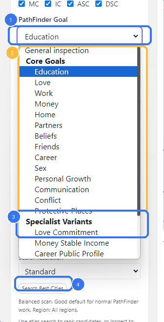
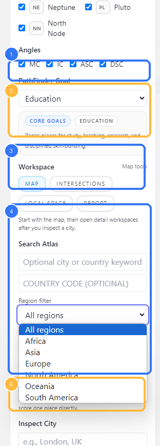
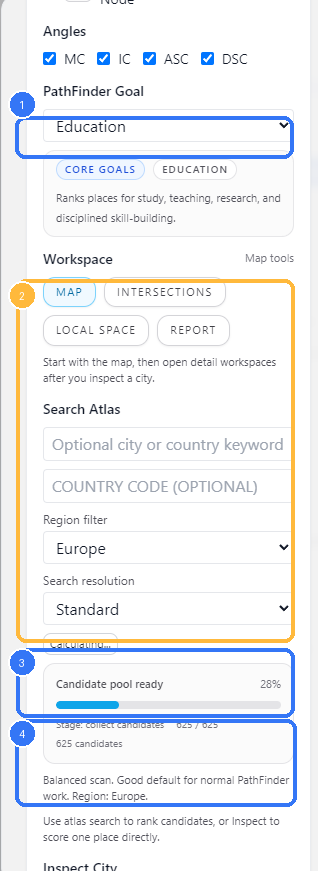
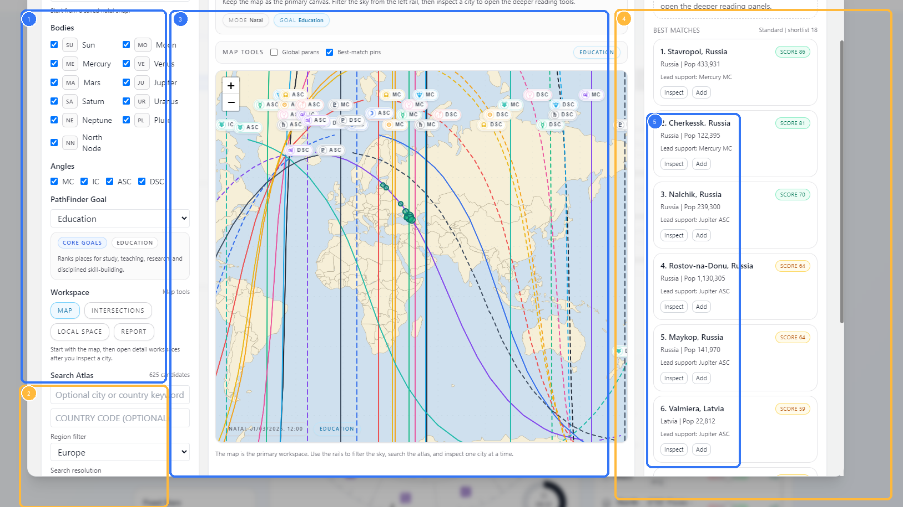

# Vox Stella Astro Clock Astrocartography PathFinder Guide

Use this guide when you want to run Astrocartography as a ranked city search instead of a map-only inspection. PathFinder is the goal-driven layer that scores atlas candidates, builds a shortlist, and lets you move from a broad region search into one inspected city at a time.

## Related Guides

- [Astrocartography Guide](VOX_STELLA_ASTRO_CLOCK_ASTROCARTOGRAPHY_GUIDE.md)
- [Saved Snaps Guide](VOX_STELLA_ASTRO_CLOCK_SAVED_SNAPS_GUIDE.md)
- [Astro Clock Guide](VOX_STELLA_ASTRO_CLOCK_GUIDE.md)

## Before You Start

PathFinder atlas search has three hard requirements in the current app:

- a saved natal snap
- a selected PathFinder goal
- body and angle filters that still include the selected goal model

If no natal snap is selected, the map and atlas workflow do not load. If no goal is selected, `Search Best Cities` does not run.

## PathFinder Goals

Figure 1. PathFinder goal families.

Legend

1. The active PathFinder goal picker
2. Core Goals in the current shipped goal list
3. Specialist Variants for narrower scoring models
4. `Search Best Cities`, which uses the selected goal

The goal picker is not cosmetic. It changes how atlas candidates are ranked.

In the current frontend, the list is grouped into:

- `Core Goals`
- `Specialist Variants`

The selected goal also exposes a short summary card in the left rail so you can confirm what the current scoring model is trying to prioritize.

## Set The Search Scope

Figure 2. Search setup in the left rail.

Legend

1. Angle filters, which affect both the map and atlas ranking
2. Goal summary card for the selected PathFinder model
3. Workspace tabs
4. Search Atlas fields, including keyword, country code, and region filter
5. Inspect City, used for direct one-place scoring instead of atlas ranking

The Search Atlas section gives you four main scope controls:

- optional city or country keyword
- optional country code
- region filter
- search resolution

The region filter currently offers:

- `All regions`
- `Africa`
- `Asia`
- `Europe`
- `North America`
- `Oceania`
- `South America`

The resolution chooser currently offers:

- `Coarse`
- `Standard`
- `Fine`
- `Ultra`

In the frontend text, these are described as:

- `Coarse`: fastest scan
- `Standard`: good default for normal PathFinder work
- `Fine`: denser scan and deeper shortlist
- `Ultra`: deepest atlas scan, using the full shipped catalog and live query augmentation

Use the broadest practical search first. Narrow the region or increase the resolution when the initial shortlist is too weak or too broad.

## Run Atlas Search

Figure 3. Atlas-search progress state.

Legend

1. The selected PathFinder goal
2. The live atlas-search panel while the search session is running
3. Candidate-pool progress and percent complete
4. Resolution and region context for the current run

`Search Best Cities` starts an atlas-search session and then polls the backend for progress until a final result is ready.

In the current frontend and backend flow:

1. the modal submits the selected snap, goal, filters, region, and resolution
2. the backend starts a queued atlas-search session
3. the UI polls the session progress endpoint
4. the final shortlist is fetched from the result endpoint

This is why the UI can show staged progress, percent complete, and candidate counts instead of freezing the modal while the full search runs.

If your current body and angle filters remove everything needed for the selected goal, the backend rejects the run. In practice, that means you should not over-prune the sky before running PathFinder.

## Read The Best Matches Rail

Figure 4. Best Matches shortlist in the map workspace.

Legend

1. The left rail with snap, filters, goal, and atlas search controls
2. The Search Atlas block that produced the shortlist
3. The map workspace, including best-match pins
4. The Best Matches rail
5. Candidate cards with `Inspect` and `Add`

Once the search finishes, the map workspace stays primary and the shortlist appears in the right rail.

Each match card shows:

- rank
- city name and country
- population when available
- score badge
- lead support line
- `Inspect`
- `Add`

Use `Inspect` when you want to anchor the rest of the workspace to one city and continue into:

- `Intersections`
- `Local Space`
- `Report`

The map can also show best-match pins so you can keep the shortlist connected to the actual line geometry.

## Atlas Search Versus Inspect City

The two workflows are related, but they are not the same.

- Use `Search Best Cities` when you want PathFinder to rank the atlas for a selected goal.
- Use `Inspect City` when you already have a place in mind and want to score that single location directly.

The left-rail helper text is explicit about this division: atlas search ranks candidates, while inspection scores one place directly.

## Practical Workflow

For most Astrocartography PathFinder work, the clean order is:

1. load the natal snap you want to use
2. choose the bodies and angles that matter
3. choose a PathFinder goal
4. start with `Standard` resolution and a broad region
5. run `Search Best Cities`
6. inspect the strongest city from the shortlist
7. open `Intersections`, `Local Space`, or `Report` only after one city is selected

## Notes

- Atlas search is goal-driven. It is not just a generic location search.
- A saved natal snap is required before the map and atlas tools can run.
- Body and angle filters affect PathFinder results, not only the visible map.
- `Ultra` resolution is the deepest atlas scan and can take longer than the lighter modes.
- The map remains the primary workspace even when you are using PathFinder. The shortlist is meant to feed inspection, not replace it.
