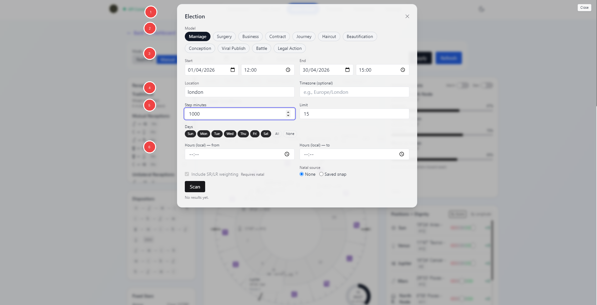
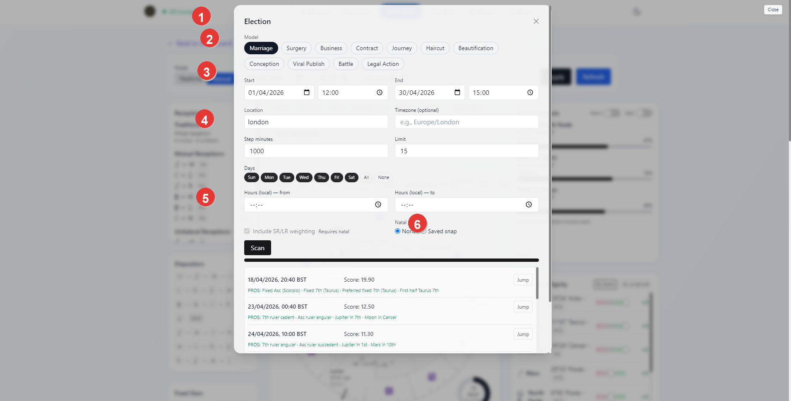

# Vox Stella Astro Clock Election Guide

Use Election to scan a time window for stronger moments for a selected matter, compare the highest-ranking results, jump a chosen time back into Astro Clock, and export the current top list as CSV.

## What The Election Tool Does

The current Election modal runs a streamed scan over a chosen date range and location.

It can:

- scan for a supported election model
- rank the top candidate times
- show a short pros and cautions summary for each result
- jump a chosen result back into Astro Clock
- export the current top list as CSV

## Screen At A Glance

Figure 1. Election setup workspace.

Legend

1. Election title and close control
2. Model picker
3. Date, time, and location range inputs
4. Scan step and result limit controls
5. Day and hour filters
6. Natal source and scan actions

## Available Models

The current UI supports these election models:

- Marriage
- Surgery
- Business
- Contract
- Journey
- Haircut
- Beautification
- Conception
- Viral Publish
- Battle
- Legal Action

The shared scan workflow stays the same, but the middle controls change with the chosen model.

## Shared Scan Controls

Every model uses the same base inputs:

- start date and time
- end date and time
- location
- optional time zone
- step minutes
- result limit
- allowed weekdays
- local hour range

These inputs define the scan window and how densely the scan moves through it.

## Natal Source

Election can work in two modes:

- `None`
- `Saved snap`

When a saved snap is selected, the modal can pass that natal context into the election engine.

This matters because some election models support natal overlay features such as:

- natal promise checks
- return or direction weighting
- SR or LR weighting

The `Include SR/LR weighting` toggle is only available when a natal saved snap is active.

## Model-Specific Options

Different models add different controls.

Examples from the current UI include:

- `Surgery`: procedure type, body part, lunation screen, fixed-star screening
- `Business`: business mode, commerce emphasis, lunation screen, weekday weighting, fixed stars
- `Contract`: context, fixed Asc preference, Saturn binding option, Mercury-direct delay, fixed stars
- `Journey`: long or short journey and optional fixed-star screening
- `Battle`: action focus, traditional timing, fixed-star screening
- `Haircut`: balanced, growth, or longer-lasting focus
- `Beautification`: procedure type, body parts, sign overrides, timing and fixed-star toggles
- `Conception`: fertility guidance, optional sex focus, timing and fixed-star toggles
- `Viral Publish`: natal overlay, timing, and fixed-star toggles
- `Legal Action`: filing, response, or counter-filing, plus timing and fixed-star toggles

This is why the Election modal changes shape as you switch models.

## Running A Scan

Click `Scan` after the required fields are filled in.

The modal opens a streamed scan and shows a progress bar while the scan is running.

The current frontend also validates obvious input issues before scanning, such as:

- missing start or end date and time
- end before start
- missing location
- invalid local hour range

## Reading Results

Figure 2. Election results list.

Legend

1. Election title and active modal
2. Active model row
3. Shared range and location controls
4. Scan tuning fields
5. Top ranked result rows
6. `Jump` action for a selected result

Each result row shows:

- the candidate local timestamp
- the score
- a short `PROS` summary
- a short `CAUTIONS` summary when present
- a `Jump` button

The result list is meant to help you compare the short-ranked candidates quickly before loading one back into the main Astro Clock workspace.

## Jumping Back Into Astro Clock

`Jump` pushes the selected election timestamp back into Astro Clock.

The current flow prefers:

- the streamed result timestamp
- the current election location
- the resolved or explicit time zone

This is the fastest way to turn a promising election result into the active Astro Clock chart for deeper inspection.

## Exporting

When results exist, the modal exposes `Download Top (CSV)`.

The export includes:

- timestamp
- score
- tags summary

This is a lightweight export of the current ranked result list, not a full narrative report.

## Practical Workflow

For most users, the cleanest Election workflow is:

1. choose the election model
2. set the date range, location, and scan density
3. narrow the days and local hours if needed
4. add a saved natal snap when you want natal overlay behavior
5. run the scan
6. compare the top results
7. use `Jump` to inspect the best candidates back in Astro Clock
8. export the top list if you want to keep the shortlist outside the modal

## Notes

- Not every model requires a saved snap.
- A saved snap becomes important when you want natal promise or SR/LR style weighting.
- The result list is a ranked shortlist. Use `Jump` and the main Astro Clock workspace when you want to inspect a chosen candidate more fully.
