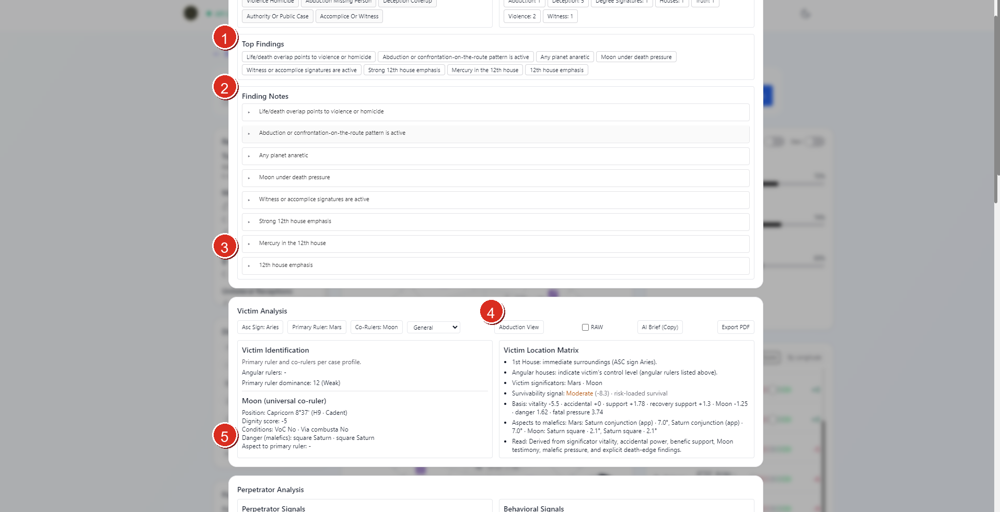
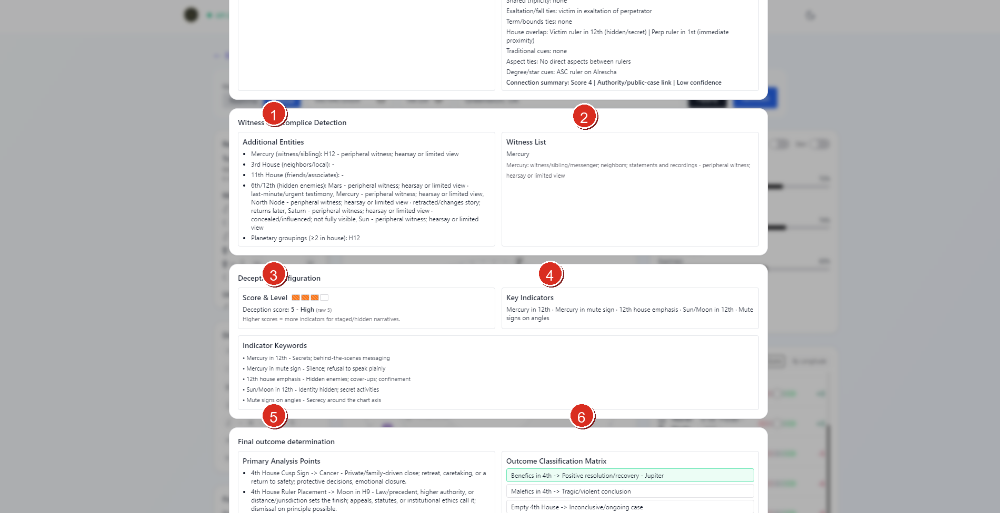
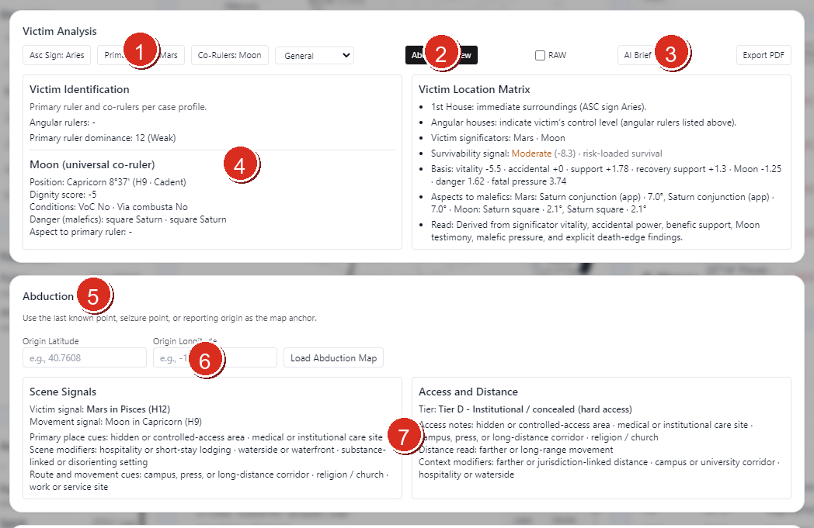

# Vox Stella Astro Clock Forensic Guide

Use the Forensic workspace to run a knowledge-based forensic reading on the active Astro Clock chart, review its finding stack, inspect the main investigative sections, and optionally switch into abduction-specific cues and mapping.

## Before You Start

Forensic reads the active Astro Clock chart.

- If you want to investigate a previously saved chart, load that saved snap into Astro Clock first and then open `Forensic`.
- If Astro Clock is in `Realtime`, Vox Stella freezes the live chart into a stable snapshot before the forensic workspace opens.
- The modal supports different case profiles and an optional abduction mode, but it still starts from the active chart context already held in Astro Clock.

## Screen At A Glance

Figure 1. Forensic overview with findings and the first analysis blocks.

Legend

1. Top Findings summary chips
2. Finding Notes header and expandable note stack
3. Lower portion of the finding-note stack before the deeper analysis cards
4. Victim Analysis header and control row
5. Main victim-analysis panels leading into the lower analysis sections

The upper part of the workspace does two jobs first:

- it compresses the strongest rule hits into `Top Findings`
- it keeps the fuller rationale in `Finding Notes`

Below that, the modal moves into the larger analysis sections.

## Top Controls

The current Forensic header includes:

- a case-profile selector
- `Abduction View`
- `RAW`
- `AI Brief (Copy)`
- `Export PDF`

### Case Profile

The current UI supports these case profiles:

- `General`
- `Child case`
- `Adult female`

The selected profile changes how the victim significators are framed in the analysis.

### RAW

`RAW` adds the compact raw-value block to the AI brief output. This is useful when you want the copied brief to carry the chart data in a more explicit technical form.

### AI Brief (Copy)

`AI Brief (Copy)` copies a structured forensic brief built from the current forensic state.

That brief is generated from the same chart, findings, and optional abduction context you are seeing in the modal.

### Export PDF

`Export PDF` exports the current forensic report from the live modal state.

This is the cleanest way to preserve the current workspace as a standalone report once the chart and settings are where you want them.

## Main Investigative Sections

Figure 2. Forensic detail sections below the opening analysis cards.

Legend

1. Witness & Accomplice Detection section
2. Witness List panel
3. Deception Configuration score block
4. Deception key-indicator panel
5. Indicator keyword summary
6. Final outcome determination section

Once you move past the opening findings and victim or perpetrator blocks, the modal expands into the core working sections.

### Victim Analysis

The first large section focuses on the victim-significator side of the chart.

The current UI can surface:

- primary ruler and co-ruler framing from the case profile
- Moon condition as a universal co-ruler
- angularity, dignity, and danger notes
- a victim-location matrix
- survivability signal and supporting basis notes

### Perpetrator Analysis

The next major section turns to perpetrator signals and behavioral framing.

In the current workspace this includes distinct panels such as:

- perpetrator signals
- behavioral signals
- relationship-style or linkage cues when the chart supports them

### Witness & Accomplice Detection

This section focuses on additional entities and witness-style signatures.

It can surface:

- additional entity notes
- witness lists
- related house and planetary grouping cues

### Deception Configuration

This section scores concealment or staging pressure in the chart.

It can show:

- a deception score and level
- key indicators
- indicator keywords that summarize the strongest deception-related signals

### Final Outcome Determination

This section collects the outcome-facing conclusions from the current chart.

It can include:

- primary analysis points
- an outcome classification matrix
- category-driven final read pressure

## Abduction View

Figure 3. Abduction-specific mode with cue panels and map controls.

Legend

1. Case-profile and victim-significator summary controls
2. `Abduction View` toggle
3. `RAW`, `AI Brief (Copy)`, and `Export PDF` actions
4. Victim Analysis remains visible in abduction mode
5. `Abduction Cues` section
6. Origin latitude, origin longitude, and `Load Abduction Map`
7. Scene-signal and access-distance summaries

`Abduction View` adds location-and-route oriented panels on top of the base forensic reading.

The current abduction workflow is:

1. switch on `Abduction View`
2. enter the origin point
3. click `Load Abduction Map`
4. read the cue summaries and map output

The UI text explicitly recommends using the last known point, seizure point, or reporting origin as the map anchor.

### What Abduction Mode Adds

When abduction mode is active, the workspace adds:

- an `Abduction Cues` section
- origin latitude and longitude inputs
- `Load Abduction Map`
- scene-signal summaries
- access-and-distance summaries
- an `Abduction Map` section farther down when the origin and map data are available

This mode is an extension of the current forensic reading, not a separate chart workspace.

## Practical Workflow

For most users, the cleanest Forensic workflow is:

1. load the chart you want Astro Clock to hold
2. load a saved snap first if the investigation should be tied to a previously stored chart
3. open `Forensic`
4. choose the case profile that matches the case
5. read `Top Findings` and `Finding Notes` first
6. move through Victim Analysis, Perpetrator Analysis, Witness & Accomplice Detection, Deception Configuration, and Final outcome determination
7. turn on `Abduction View` only if the case needs the location and movement layer
8. use `AI Brief (Copy)` or `Export PDF` once the workspace reflects the state you want to preserve

## Notes

- Forensic works from the active Astro Clock chart rather than a separate saved-snap selector inside the modal.
- Loading a saved snap first changes what the forensic engine reads.
- `RAW` affects the copied AI brief, not just the visual layout.
- Abduction mode is optional and only becomes fully useful once you provide an origin point and load the map.
