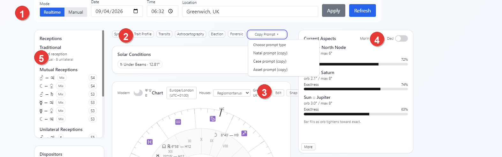
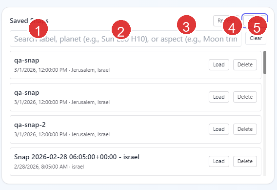
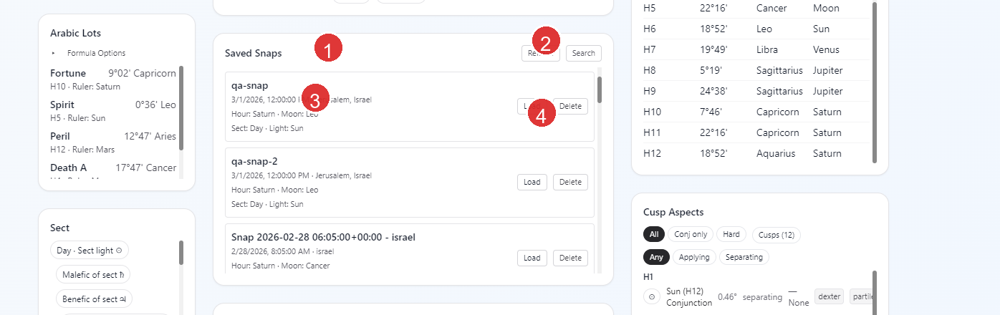
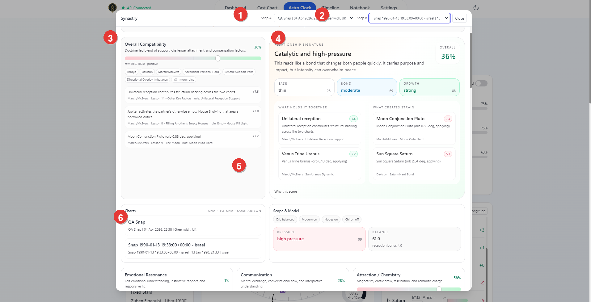
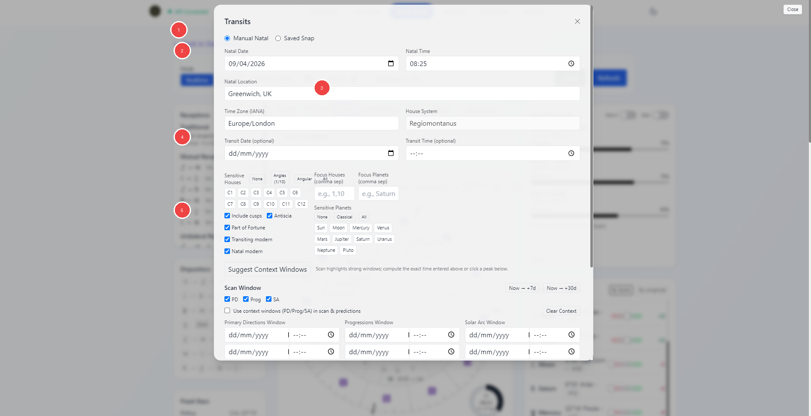
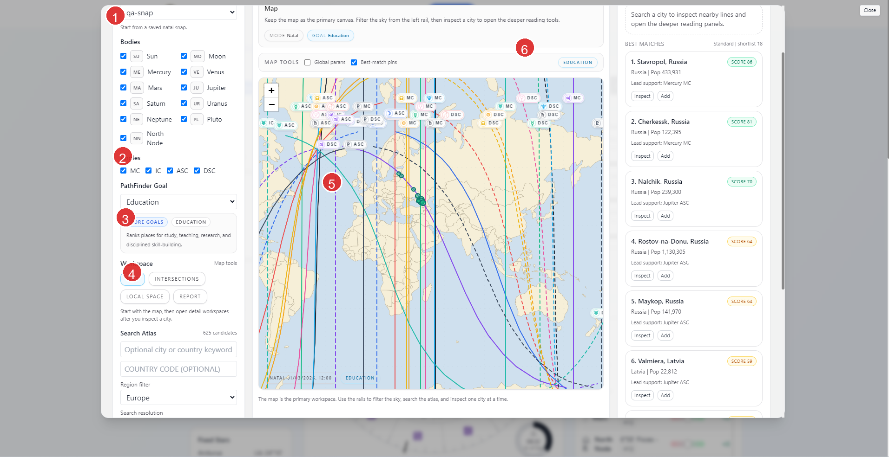

# Vox Stella Astro Clock Guide

Use Astro Clock to watch the current chart, freeze a chart into manual mode, save reusable snaps, and launch the deeper Astro Clock tools from a stable chart context.

## Related Guides

Use this page as the Astro Clock overview. For focused walkthroughs, continue with:

- [Saved Snaps Guide](VOX_STELLA_ASTRO_CLOCK_SAVED_SNAPS_GUIDE.md)
- [Aspect Analysis Guide](VOX_STELLA_ASTRO_CLOCK_ASPECT_ANALYSIS_GUIDE.md)
- [Synastry Guide](VOX_STELLA_ASTRO_CLOCK_SYNASTRY_GUIDE.md)
- [Election Guide](VOX_STELLA_ASTRO_CLOCK_ELECTION_GUIDE.md)
- [Transits Guide](VOX_STELLA_ASTRO_CLOCK_TRANSITS_GUIDE.md)
- [Astrocartography Guide](VOX_STELLA_ASTRO_CLOCK_ASTROCARTOGRAPHY_GUIDE.md)
- [Astrocartography PathFinder Guide](VOX_STELLA_ASTRO_CLOCK_ASTROCARTOGRAPHY_PATHFINDER_GUIDE.md)
- [Trait Profile Guide](VOX_STELLA_ASTRO_CLOCK_TRAIT_PROFILE_GUIDE.md)
- [Forensic Guide](VOX_STELLA_ASTRO_CLOCK_FORENSIC_GUIDE.md)
- [Astro Clock Guides Index](VOX_STELLA_ASTRO_CLOCK_GUIDES_INDEX.md)

## Screen At A Glance

Figure 1. Astro Clock workspace overview.

Legend

1. Realtime and Manual chart controls
2. Feature launch bar
3. Main chart panel, including the Snap button
4. Current Aspects card and the `More` entry point into Aspect Analysis
5. Reference tiles for receptions and related chart context

The Astro Clock workspace combines three jobs in one place:

- follow the current chart in realtime
- move the chart into a fixed manual state
- hand that chart context to the other Astro Clock tools

The main workspace also shows reference panels such as receptions, dispositors, fixed stars, solar conditions, Moon condition, saved snaps, metrics, cusps, cusp aspects, and bearings.

## Realtime And Manual Modes

Figure 2. Realtime and Manual controls.

Legend

1. Mode toggle
2. Date and time inputs
3. Location input
4. Apply button
5. Refresh button

The current UI calls the live mode `Realtime`. If you think of this as the automatic mode, that is the correct equivalent.

### Realtime

Use Realtime when you want Astro Clock to follow the active live chart for the current moment and place.

- The chart updates automatically while Realtime is active.
- Refresh re-requests the current Astro Clock data without changing mode.
- If you open a deeper Astro Clock feature from Realtime, Vox Stella pauses the live chart first so the modal works from a stable chart state.

### Manual

Use Manual when you want to hold Astro Clock on a fixed chart.

- Enter a date, time, and location.
- Click `Apply` to switch the workspace to that fixed chart.
- The chart stays on that saved moment until you change it or return to Realtime.

Loading a saved snap also moves Astro Clock into Manual mode using the snap's stored date, time, and location.

## Saved Snaps

Figure 3. Saved Snaps panel.

Legend

1. Saved Snaps section
2. Refresh and Search or Snaps toggle
3. Snap label, timestamp, and location
4. Load and Delete actions

Saved snaps are not screenshots. They are stored chart snapshots that keep the chart timestamp, location, a summary, and the chart payload needed by other Astro Clock tools.

### How To Create A Snap

- In the main chart panel, click `Snap`.
- Vox Stella saves the current Astro Clock chart with a generated label based on the current timestamp and location.

### What A Saved Snap Includes

Each snap can carry:

- the saved chart timestamp
- the saved location
- the saved chart summary, including the planetary hour ruler, Moon sign, and chart sect
- the stored chart payload used by snap-based tools

### What You Can Do In Saved Snaps

- `Refresh` reloads the saved snap list.
- `Load` restores that snap into Astro Clock and places the workspace in Manual mode.
- `Delete` removes the snap from local storage.
- `Search` switches the panel into search mode.

Search mode can search more than labels. It indexes saved snap content so you can search:

- snap labels
- location text
- planet names with sign and house combinations such as `Sun Leo H10`
- stored aspect phrases such as `Moon trine Venus`

Use the dedicated [Saved Snaps Guide](VOX_STELLA_ASTRO_CLOCK_SAVED_SNAPS_GUIDE.md) when you want the full storage, search, and cross-feature workflow explanation.

## Why Saved Snaps Matter

Saved snaps are the bridge between the main Astro Clock view and the deeper Astro Clock features.

- They let you return to a chart later without rebuilding it manually.
- They let you move a previously saved chart back into the main Astro Clock workspace.
- Some Astro Clock tools require saved snaps.
- Other Astro Clock tools can work without a saved snap, but become stronger or more specific when one is available.

## How Saved Snaps Feed Other Astro Clock Tools

### Synastry

Synastry is fully snap-based.

- It requires two different saved snaps.
- You choose one chart as `Snap A` and one chart as `Snap B`.
- The report compares those saved charts directly.

Figure 4. Synastry is a snap-to-snap comparison.

Legend

1. Snap A selector
2. Snap B selector
3. Overall compatibility panel
4. Relationship signature and primary interpretation
5. Snap-to-snap chart comparison card
6. Scope and model controls

### Transits

Transits can work in two ways:

- `Manual Natal`, where you enter natal date, time, and location directly
- `Saved Snap`, where a saved Astro Clock snap becomes the natal source

Figure 5. Transits can use a saved snap or manual natal input.

Legend

1. Natal source selector
2. Natal chart fields
3. Transit date, transit time, and house-system setup
4. Sensitivity filters for houses, planets, and optional layers
5. Context-window and scan-window controls

In the current app:

- point-in-time transit reading can use either manual natal data or a saved snap
- window scanning can use either manual natal data or a saved snap
- the predictor can use either manual natal data or a saved snap

If you choose `Saved Snap`, the selected snap becomes the natal chart source for the scan and predictor paths.

### Astrocartography

Astrocartography is snap-first in the current app.

- A saved natal snap is required.
- If you do not have one yet, the modal can save the current Astro Clock chart as your first natal snap.
- Transit mode adds an overlay on top of the natal map instead of replacing the natal base.

Figure 6. Astrocartography starts from a saved natal snap.

Legend

1. Natal snap selector
2. PathFinder Goal chooser
3. Workspace tabs
4. Search Atlas controls
5. Map workspace
6. Best Matches or inspector rail

The Astrocartography workspace includes:

- `Map`
- `Intersections`
- `Local Space`
- `Report`

The main flow is:

1. choose a saved natal snap
2. choose a PathFinder goal if needed
3. inspect the map or search best cities
4. open a city for deeper reading
5. move into the other workspaces when you want a more focused interpretation

Use the dedicated [Astrocartography Guide](VOX_STELLA_ASTRO_CLOCK_ASTROCARTOGRAPHY_GUIDE.md) for the main map workflow and the [Astrocartography PathFinder Guide](VOX_STELLA_ASTRO_CLOCK_ASTROCARTOGRAPHY_PATHFINDER_GUIDE.md) when you want the goal families, atlas search progress, and best-match shortlist flow in detail.

### Election

Election does not always require a saved snap, but a saved snap changes what the engine can do.

- Without a saved snap, election scanning can still run from transit-only chart conditions.
- With a saved snap, supported matters can layer natal promise checks and related natal timing context.

In the current UI, the election modal exposes `Natal source` as `None` or `Saved snap`.

### Trait Profile

Trait Profile works from the active Astro Clock chart.

- If Astro Clock is in Realtime, the app pauses that live chart first before opening the modal.
- If you want Trait Profile to read a previously saved chart, load that snap into Astro Clock first and then open Trait Profile.
- Use the dedicated [Trait Profile Guide](VOX_STELLA_ASTRO_CLOCK_TRAIT_PROFILE_GUIDE.md) when you want the full filter, source-layer, and house-influence walkthrough.

### Forensic

Forensic also works from the active Astro Clock chart.

- Opening it from Realtime pauses the chart first.
- If you want the forensic tools to read a previously saved chart, load the snap into Astro Clock first.
- Use the dedicated [Forensic Guide](VOX_STELLA_ASTRO_CLOCK_FORENSIC_GUIDE.md) for the investigative sections, abduction mode, AI brief, and export workflow.

## Other Astro Clock Entry Points

### Current Aspects And Aspect Analysis

The Current Aspects card shows the strongest live aspect set in the current chart.

- Use `More` to open the fuller Aspect Analysis modal.
- Aspect Analysis lets you switch between planetary aspects, declinations, and cusps.

### Copy Prompt

The `Copy Prompt` menu uses the current Astro Clock context to copy:

- natal prompt
- case prompt
- asset prompt

These prompt helpers are tied to the active chart context, so loading a snap first changes the context they copy from.

## Practical Workflow

For most users, the cleanest Astro Clock workflow is:

1. start in Realtime to inspect the current chart
2. switch to Manual when you want to hold a fixed time
3. click `Snap` when a chart should be kept for later reuse
4. load a saved snap before opening any feature that should read that exact chart
5. use snap-based tools such as Synastry or Astrocartography when you need persistent chart references

## Notes

- Saved snaps are stored locally for this app installation.
- Loading a snap is the fastest way to turn a previously saved chart into the active Astro Clock context.
- Synastry requires two different saved snaps.
- Astrocartography requires a saved natal snap.
- Transits can work either from manual natal inputs or a saved snap.
- Election can run without a snap, but a saved snap unlocks natal overlay behavior for supported matters.
