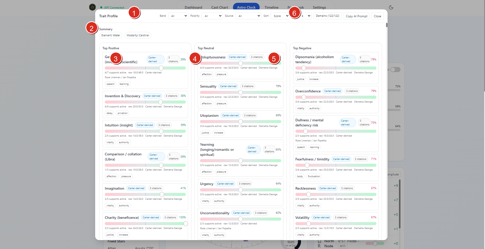
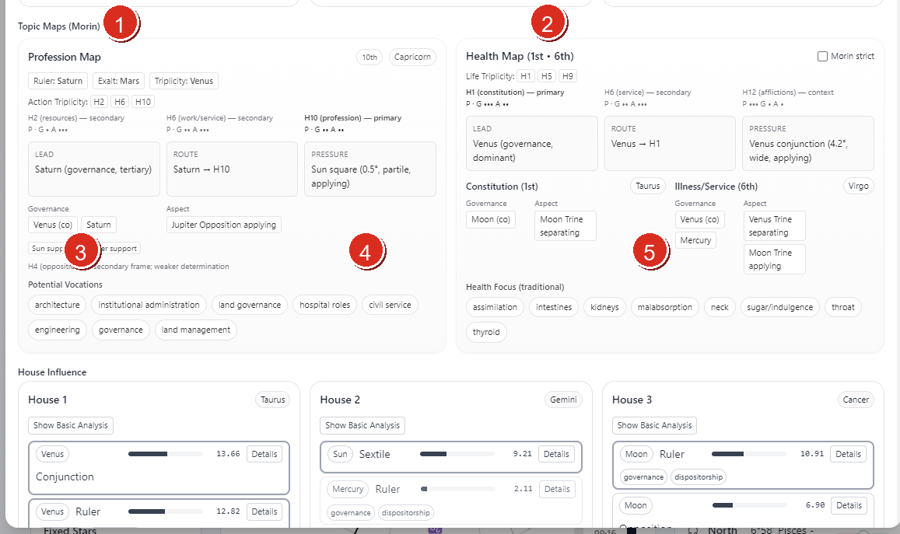

# Vox Stella Astro Clock Trait Profile Guide

Use Trait Profile to read the active Astro Clock chart as a structured profile of tendencies, source layers, topic maps, and house-based determinations.

## Before You Start

Trait Profile reads the active Astro Clock chart.

- If you want to analyze a previously saved chart, load that saved snap into Astro Clock first and then open Trait Profile.
- If Astro Clock is still in `Realtime`, Vox Stella pauses the live chart before the modal opens so the profile is built from a stable chart context.
- Trait Profile does not ask for a second chart or a separate saved-snap selector inside the modal itself.

## Screen At A Glance

Figure 1. Trait Profile overview with filters and top-trait splits.

Legend

1. Trait Profile header
2. Summary strip
3. Top Positive column
4. Top Neutral column
5. Top Negative column
6. Filter and action bar, including source filtering, domains, and `Copy AI Prompt`

## What The Modal Shows

The current modal is built around five main areas:

- a top filter bar for band, polarity, source, sort order, top-count, and domain selection
- a summary strip showing dominant element, dominant modality, and special chart flags when present
- top-trait splits for positive, neutral, and negative results
- Morin-style topic maps and house influence panels
- the full grouped trait list with source layers, citations, and evidence

## Working With Filters

The top bar lets you narrow the profile without changing the underlying chart.

### Band

`Band` filters the results by strength level.

The current UI supports:

- `All`
- `Strong`
- `Likely`
- `Possible`
- `Weak`

### Polarity

`Polarity` narrows the result list to:

- `Positive`
- `Neutral`
- `Negative`

### Source

`Source` filters the trait list by source lineage and enrichment layer.

The current UI supports:

- `All`
- `Morin-facing`
- `Classical`
- `Modern`

This filter does not change the chart. It changes which trait entries remain visible based on their attached lineage, keyword layers, and citation support.

### Domains

The `Domains` menu is the broadest filter in the modal.

You can:

- search domains by name
- select all domains
- clear all domains
- choose a smaller domain set for a narrower read

If your filter combination returns no traits, the modal shows an explicit filter notice and a `Reset filters` action.

## Summary And Top Traits

The summary area gives the quickest reading of the current chart profile.

It can show:

- dominant element
- dominant modality
- special degree tags
- chart flags such as `Mercury Shock` or `Neptune Station/Angular` when those signals are active

Below that, the modal splits the strongest returned traits into:

- `Top Positive`
- `Top Neutral`
- `Top Negative`

This is the fastest way to understand the overall balance of the current chart before reading the full grouped list.

## Topic Maps And House Influence

Figure 2. Trait Profile structure panels below the top trait lists.

Legend

1. `Profession Map`
2. `Health Map`
3. Determination-support chips and route notes within the topic maps
4. `Pressure` and similar determination-route cards inside the profession map
5. House-linked governance and aspect cards inside the health map and the start of `House Influence`

Trait Profile is not only a trait list. It also exposes chart-derived structure panels.

### Topic Maps (Morin)

When the required house data is available, the modal can show Morin-style topic maps such as:

- `Profession Map`
- `Health Map`

These panels use current house influence data, rulership structure, and supporting chart conditions to summarize the strongest determination routes around those topics.

### House Influence

The `House Influence` section expands the chart house by house.

Each house card can show:

- the house sign
- the strongest occupying, ruling, co-ruling, or aspect influences
- keyword chips for the strongest influence entries
- a `Show Basic Analysis` toggle when a basic-analysis block exists
- a `Details` view for the scoring breakdown on a given influence row

This is the main place to inspect how the engine is building trait-relevant area pressure from the chart.

## Reading Trait Cards

The full `All Traits` section groups traits by domain and orders the groups by stronger aggregate results first.

Each trait card can show:

- the trait name
- its domain
- its score and support count
- polarity direction
- description and evidence
- source lineage label
- source-layer keyword groups
- corpus citation support when available

The compact `keywords` on each trait remain the Morin-facing layer. The broader source layering appears separately under `Source Layers` and `Corpus Citations`.

## Copy AI Prompt

The `Copy AI Prompt` action prepares an analysis prompt from the current Trait Profile state.

That prompt is based on:

- the active chart context
- the current filters
- the current trait results

If you want the copied prompt to reflect a specific saved chart, load that snap first before opening Trait Profile or copying the prompt.

## Practical Workflow

For most users, the cleanest Trait Profile workflow is:

1. load the chart you want Astro Clock to hold
2. save and reload a snap first if you want an older chart rather than the current live one
3. open `Trait Profile`
4. read the summary and top positive, neutral, and negative splits
5. use `Source` and `Domains` to narrow the read when needed
6. inspect `Topic Maps (Morin)` and `House Influence` when you want the structural basis behind the trait list
7. move into the full grouped trait cards for descriptions, source layers, and citations
8. use `Copy AI Prompt` when you want to continue the analysis elsewhere from the same filtered result set

## Notes

- Trait Profile works from the active Astro Clock chart, not from a separate chart picker inside the modal.
- Loading a saved snap before opening the modal is the reliable way to analyze a specific stored chart.
- Source filtering can legitimately produce no results when the current chart and current domain selection do not contain traits for that lineage.
- The profile combines chart metrics, house influences, and source-aware enrichment. It is broader than a single keyword list.
