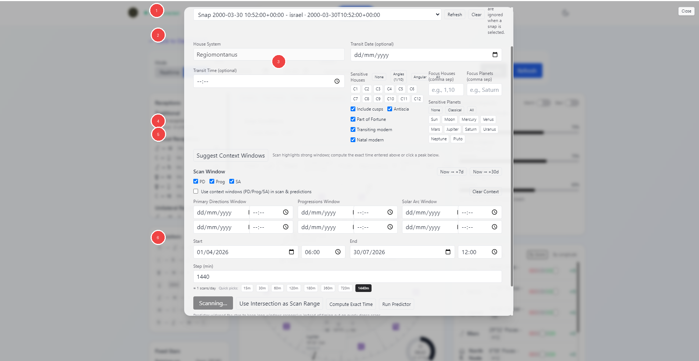
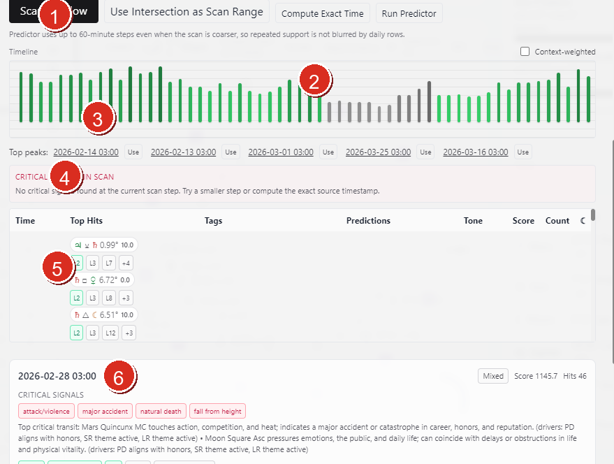
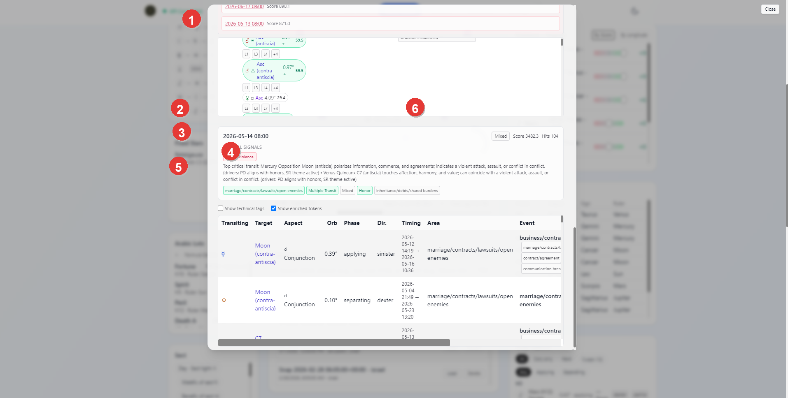

# Vox Stella Astro Clock Transits Guide

Use the Transits workspace to read a single transit chart, scan a wider date range for strong windows, compute a tighter exact time, and run the predictor over the chosen range.

## What This Tool Can Use

The current app supports two natal sources:

- `Manual Natal`, where you enter natal date, time, location, and time zone directly
- `Saved Snap`, where a saved Astro Clock snap becomes the natal source

When `Saved Snap` is active, the manual natal fields are ignored and the selected snap becomes the natal chart used by the transit routes.

## Screen At A Glance

Figure 1. Transits setup and scan workspace.

Legend

1. Source selector and saved snap picker
2. Chart setup fields, including house system and transit date or time
3. Sensitivity filters for houses, planets, and optional layers
4. `Suggest Context Windows` action
5. Scan Window range and context-window controls
6. Main scan and prediction actions

## Choosing The Natal Source

### Manual Natal

Use `Manual Natal` when you want to type the natal chart details directly.

The modal accepts:

- natal date
- natal time
- natal location
- natal time zone

### Saved Snap

Use `Saved Snap` when the natal chart already exists as a saved Astro Clock snap.

- Pick the saved snap from the selector.
- Use `Refresh` to reload the snap list.
- Use `Clear` to remove the current snap selection.

This is the cleanest way to reuse a natal chart across repeat transit work.

## Main Setup Fields

The current UI keeps the house system fixed to `Regiomontanus`.

You can also add:

- an optional transit date
- an optional transit time
- sensitive houses
- focus houses
- focus planets
- sensitive planets
- optional layers such as cusps, antiscia, Part of Fortune, transiting modern, and natal modern

These controls shape what the transit scan pays attention to.

## Context Windows

The `Suggest Context Windows` action fills optional timing windows for:

- Primary Directions
- Progressions
- Solar Arc

These context windows can then be used in two ways:

- as supporting timing layers for scans and predictions
- as inputs for `Use Intersection as Scan Range`

`Use Intersection as Scan Range` narrows the active scan range to the overlap of the enabled context windows when that overlap exists.

## Scan Window

The main `Scan Window` section defines the wider period you want to inspect.

You can:

- fill the range manually
- use quick ranges such as `Now -> +7d` or `Now -> +30d`
- choose which context layers are enabled
- decide whether those context windows should be used in scans and predictions
- choose a step size in minutes

The step size controls how dense the scan is. Smaller steps create more scan points; larger steps move faster through longer windows.

## Main Actions

The bottom action row is the working core of the modal.

- `Scan Window` scans the active range and surfaces stronger windows
- `Use Intersection as Scan Range` narrows the current range to the overlap of the enabled timing windows
- `Compute Exact Time` refines the timing from the current setup
- `Run Predictor` generates grouped support windows and predictor results for the active range

## Timeline And Predictor State

Figure 2. Transits timeline and predictor-oriented result state.

Legend

1. Main action row with scan, intersection, exact-time, and predictor actions
2. Timeline header and `Context-weighted` toggle
3. Timeline bars for the active scan window
4. Critical-signals status strip for the selected step
5. Hit table for the selected timestamp
6. Selected result card with score, hit count, and critical-signal summary

When scan results are present, the modal can move into a timeline-driven state.

This part of the UI lets you:

- click a bar in the timeline to select a timestamp
- use `Top peaks` shortcuts to jump straight to stronger moments in the scanned range
- toggle `Context-weighted` to reshape the timeline emphasis when context windows are active
- move from a broad range scan into a more focused selected-step read

This is the fastest way to move from range-level exploration into moment-level inspection without leaving the modal.

## Reading Results

Figure 3. Transits result card and evidence table.

Legend

1. Candidate or peak rows in the scan result list
2. Selected result timestamp
3. Critical signal summary
4. Area and topic chips for the selected result
5. Technical or enriched-token toggles and evidence table
6. Score and hit count for the selected result

When a scan result is selected, the modal surfaces a detailed card for that moment.

The selected result can show:

- the selected timestamp
- summary labels such as critical signals
- topical chips such as life areas or event families
- score and hit counts
- a detailed evidence table showing the transiting factor, target, aspect, orb, phase, direction, timing, area, and event labeling

This is the part of the tool that turns a broad scan into a readable candidate moment.

The current result area also supports additional display toggles such as:

- `Show technical tags`
- `Show enriched tokens`

Use these when you want the result table to lean more technical or more interpretation-friendly.

## Practical Workflow

For most users, the cleanest transit workflow is:

1. choose `Manual Natal` or `Saved Snap`
2. set any sensitivity filters that matter for the question
3. use `Suggest Context Windows` if you want the timing layers
4. define the scan range and step size
5. run `Scan Window`
6. inspect the stronger peaks
7. use `Compute Exact Time` or `Run Predictor` when you want a tighter timing pass

## Notes

- Saved snaps are optional here, not required.
- The same saved snap source can be used for point-in-time reading, scan windows, and predictor runs.
- Loading a saved natal snap is the fastest way to keep transit work consistent across repeat sessions.
